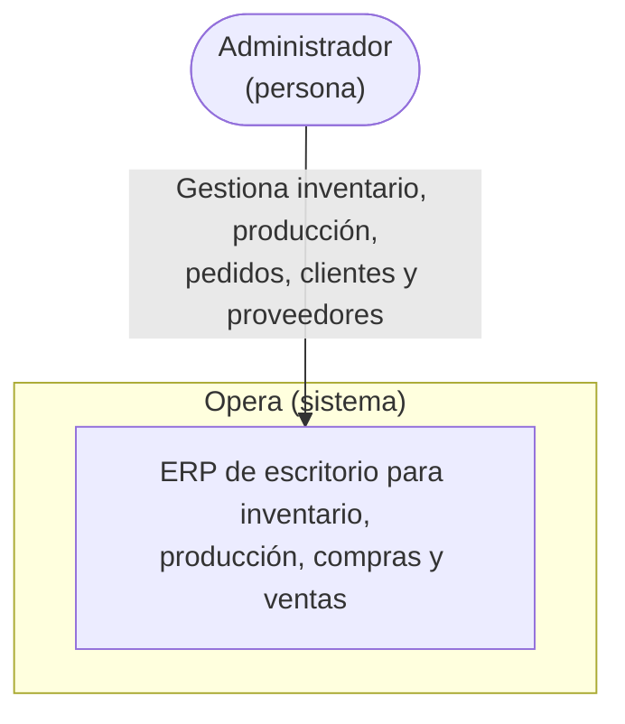
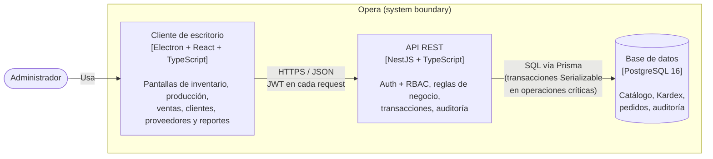

# Opera

<div align="center">


**Backend**


**Frontend / Desktop**


**Calidad y herramientas**


</div>

**Opera** — Plataforma de Gestión Operativa Empresarial: un ERP de escritorio para **inventario, producción, compras y ventas**, construido como monorepo con backend en **NestJS + Prisma + PostgreSQL** y cliente de escritorio en **Electron + React + TypeScript**.

Es un proyecto de portafolio, pero se desarrolla con las prácticas de un sistema productivo real: RBAC, trazabilidad completa de inventario (Kardex), transacciones consistentes, tests automatizados y decisiones de arquitectura documentadas.

## Índice

- [Visión](#visión)
- [¿Por qué este proyecto?](#por-qué-este-proyecto)
- [Arquitectura](#arquitectura)
- [Principios de diseño](#principios-de-diseño)
- [Stack tecnológico](#stack-tecnológico)
- [Estructura del monorepo](#estructura-del-monorepo)
- [Roadmap](#roadmap)
- [Puesta en marcha](#puesta-en-marcha)
- [Estado actual](#estado-actual)
- [Seguimiento del trabajo](#seguimiento-del-trabajo)
- [Decisiones de arquitectura (ADRs)](#decisiones-de-arquitectura-adrs)
- [Licencia](#licencia)

## Visión

Muchas pequeñas y medianas empresas manufactureras manejan su inventario y producción en hojas de cálculo, sin trazabilidad real de por qué cambió el stock, sin control de quién hizo qué, y sin una vista confiable del costo de producción. Opera busca resolver ese problema con un ERP de escritorio simple, auditable y correcto por diseño: cada movimiento de inventario queda registrado de forma permanente, cada acción queda asociada a un usuario y un rol, y el stock nunca se edita a mano — se calcula a partir de su historia.

## ¿Por qué este proyecto?

Opera es mi proyecto de portafolio para demostrar diseño de sistemas backend con reglas de negocio reales (no solo CRUDs), y las decisiones detrás de esas reglas quedan documentadas explícitamente como ADRs en vez de perderse en el código. La meta es un ERP completo y usable en producción real — inventario, producción, compras, ventas, clientes, proveedores, reportes y dashboard —, construido con la misma disciplina de ingeniería que un producto comercial: consistencia transaccional, control de acceso, auditoría y pruebas automatizadas en cada pieza que se agrega, no solo al final.

## Arquitectura

### Diagrama de contexto (C4 nivel 1)

Opera es un sistema cerrado: un solo tipo de usuario (el Administrador del
taller) opera todo el ERP, y no hay integraciones con sistemas externos —
sin pasarela de pagos, sin proveedor de correo, sin ERP externo del que
importar/exportar datos. Esa ausencia es deliberada, no un hueco: cada
dato que el negocio necesita (clientes, proveedores, inventario, ventas) se
gestiona dentro del propio sistema.



### Diagrama de contenedores (C4 nivel 2)



Dentro del contenedor **API REST**, el backend se organiza en módulos de Nest
por dominio (Auth, Inventario, Producción, Ventas/Clientes/Proveedores,
Reportes/Dashboard) — ver el detalle a nivel de componente en
[Estructura del monorepo](#estructura-del-monorepo) y el desglose de módulos en
la tabla de [Stack tecnológico](#stack-tecnológico); no se duplica aquí un
tercer diagrama (C4 nivel 3) porque la lista de módulos en
`packages/backend/src/app.module.ts` ya cumple ese rol sin necesitar
mantenerse en dos lugares a la vez.

## Principios de diseño

- **Kardex append-only**: los movimientos de inventario (`StockMovement`) nunca se editan ni se borran. El stock actual siempre se deriva de la suma de movimientos, nunca es un campo que se sobreescribe directamente.
- **Un solo catálogo de ítems**: productos terminados, materias primas e insumos son `Product` con distinto `type`, no tablas separadas — así `StockMovement` referencia un único `productId` y todo comparte el mismo Kardex.
- **RBAC desde la base**: todo endpoint sensible pasa por un guard de roles/permisos reutilizable, no por chequeos ad-hoc dispersos en el código.
- **Auditoría real**: cada acción relevante sobre una entidad queda registrada en `AuditLog` con el estado anterior y posterior.
- **Consistencia transaccional**: operaciones críticas (ajustes de stock, cierre de órdenes de producción) usan transacciones de Prisma con nivel de aislamiento explícito para evitar condiciones de carrera.
- **Decisiones documentadas**: cambios de arquitectura relevantes se registran como ADR, no solo en el mensaje de commit.

## Stack tecnológico

| Capa                     | Tecnología                                            |
| ------------------------ | ----------------------------------------------------- |
| Backend                  | NestJS, TypeScript, Prisma ORM                        |
| Base de datos            | PostgreSQL 16                                         |
| Autenticación            | JWT + Argon2                                          |
| Frontend / Desktop       | Electron, React, Vite, TypeScript, Tailwind CSS       |
| Formularios y validación | React Hook Form + Zod                                 |
| Estado de datos remotos  | TanStack Query                                        |
| Testing                  | Jest (unitarios/integración), Playwright (end-to-end) |
| Documentación de API     | Swagger / OpenAPI (`@nestjs/swagger`)                 |
| Generación de documentos | PDF (`pdfkit`)                                        |
| Calidad de código        | ESLint, Prettier, Husky, lint-staged                  |
| CI/CD                    | GitHub Actions                                        |
| Empaquetado desktop      | electron-builder                                      |
| Infraestructura local    | Docker Compose                                        |

## Estructura del monorepo

```
opera/
├── .github/
│   └── workflows/   # CI (lint + build en cada PR)
├── .husky/
│   └── pre-commit   # lint-staged (ESLint + Prettier)
├── packages/
│   ├── backend/     # API NestJS + Prisma
│   └── desktop/     # Cliente Electron + React + Vite + Tailwind
├── docs/
│   └── adr/         # Architecture Decision Records
├── docker-compose.yml
├── eslint.config.mjs
├── .env.example
├── package.json
├── pnpm-workspace.yaml
└── README.md
```

> Ver [`docs/adr/`](docs/adr/) para las decisiones de arquitectura documentadas hasta ahora.

## Roadmap

El trabajo está organizado en milestones, cada uno con sus issues de seguimiento en GitHub. **Avance: 91/94 issues cerradas (~97%), 6 de 7 milestones completos.** Ese número no pesa parejo: M5 por sí sola son 26 issues que agregan cuatro dominios de negocio nuevos completos (clientes, proveedores, ventas/remisiones con estado de pago) — en esfuerzo real es más cercano al 50-55% del proyecto total.

| Milestone                                                                                        | Alcance                                                                                                                       | Estado   |
| ------------------------------------------------------------------------------------------------ | ----------------------------------------------------------------------------------------------------------------------------- | -------- |
| [M0 - Setup del repositorio](https://github.com/TomasPosada0626/opera/milestone/1)               | Monorepo, linting, Docker Compose, CI base                                                                                    | ✅ 6/6   |
| [M1 - Backend: Auth + RBAC](https://github.com/TomasPosada0626/opera/milestone/2)                | Prisma schema base, JWT + Argon2, guard RBAC, Swagger, CI con tests y `pnpm audit`                                            | ✅ 13/13 |
| [M2 - Inventario + Kardex](https://github.com/TomasPosada0626/opera/milestone/3)                 | Módulo insignia: bodegas/ubicaciones, Kardex append-only, transacciones consistentes, filtros reutilizables, alertas de stock | ✅ 15/15 |
| [M3 - Producción](https://github.com/TomasPosada0626/opera/milestone/4)                          | BOM, órdenes de producción, costeo                                                                                            | ✅ 8/8   |
| [M4 - Frontend Electron](https://github.com/TomasPosada0626/opera/milestone/5)                   | Cliente de escritorio, pantallas de inventario y producción                                                                   | ✅ 18/18 |
| [M5 - Ventas/Compras/Clientes/Proveedores](https://github.com/TomasPosada0626/opera/milestone/6) | Ventas, compras, clientes, proveedores, saldos pendientes, reportes (PDF/Excel), dashboard, búsqueda global                   | ✅ 26/26 |
| [M6 - Calidad y documentación](https://github.com/TomasPosada0626/opera/milestone/7)             | E2E, CI completo, ADRs, diagrama C4, revisión de seguridad final                                                              | 🟨 4/7   |

## Puesta en marcha

Requisitos: Node.js ≥ 24, pnpm ≥ 9, Docker.

```bash
cp .env.example .env
pnpm install

# PostgreSQL 16 local
docker compose up -d

# Cliente de Prisma (regenerar tras cualquier cambio de schema.prisma)
pnpm db:generate

# Aplica las migraciones ya commiteadas
pnpm db:deploy

# Crea el rol y usuario Administrador inicial (ver ADMIN_EMAIL/ADMIN_PASSWORD en .env)
pnpm db:seed

# Backend (NestJS) — http://localhost:3000 (docs interactivos en /docs)
pnpm dev:backend

# Desktop (Electron)
pnpm dev:desktop
```

> Si el puerto 5432 ya está en uso en tu máquina (por ejemplo, otro PostgreSQL local), ajusta `POSTGRES_PORT` y el puerto de `DATABASE_URL` en tu `.env` — ambos los lee `docker-compose.yml` y Prisma respectivamente.

## Estado actual

✅ **M0** y **M1 (Backend: Auth + RBAC)** cerrados. El backend tiene: Prisma conectado a PostgreSQL, schema de RBAC (`User`, `Role`, `Permission`) y `AuditLog` (ledger append-only) migrados; login JWT con contraseñas Argon2; guard RBAC reutilizable (`@Roles`/`@Permissions` + `RbacGuard`) que revalida contra la base de datos en cada request (no solo contra el token); CRUD de usuarios (solo Administrador) con auditoría en cada mutación; reseteo de contraseña por Administrador; seed del usuario Administrador inicial (`pnpm db:seed`); docs interactivos en `/docs` (Swagger/OpenAPI); y CI que corre lint, tests (26 tests, 6 suites), `pnpm audit` y build en cada push/PR, más Dependabot semanal. Una revisión de seguridad de cierre (`/security-review`) encontró y corrigió un hallazgo real (JWT sin revalidación — ver [issue #79](https://github.com/TomasPosada0626/opera/issues/79)).

✅ **M2 (Inventario + Kardex)** cerrado. `Warehouse` (bodegas), `Product`/`Category`/`Unit` (catálogo) y `StockMovement` (Kardex append-only, ver [ADR 0001](docs/adr/0001-kardex-append-only.md)) migrados, con CRUD completo para bodegas/categorías/unidades/productos. `GET /inventory/:productId/stock` calcula el stock actual (global y por bodega) sumando movimientos — nunca un campo editable. Los tres tipos de movimiento (`entradas`, `salidas`, `ajustes`) son ADMIN-only (único rol que existe hoy — ver revisión de seguridad más abajo); salida y ajuste comparten una transacción `Serializable` que valida que el stock resultante nunca sea negativo, sin condición de carrera entre movimientos concurrentes — probado con un test de integración real contra Postgres que dispara 10 salidas simultáneas por más de lo disponible y confirma que el stock final nunca queda mal (`pnpm test:e2e`, ya corriendo en CI con su propio Postgres). `GET /inventory/:productId/kardex` devuelve el historial de movimientos de un producto (más reciente primero, con bodega y usuario incluidos), filtrable por bodega. Paginación, orden y búsqueda son una utilidad compartida (`ListQueryDto` + `paginate()`) aplicada de forma pareja a los listados de bodegas, categorías, unidades, productos (búsqueda por nombre o SKU) y el Kardex — todos devuelven `{ data, meta }` con `page`/`pageSize`/`total`/`totalPages`. `GET /inventory/alertas/bajo-stock` reporta los productos activos cuyo stock calculado está por debajo de su `minStock` configurado (los productos sin umbral no se evalúan — `null` es "sin umbral", no "alertar en 0").

Al cerrar M2 se corrió una revisión de seguridad dedicada sobre todo el milestone (mismo patrón que [issue #79](https://github.com/TomasPosada0626/opera/issues/79) al cerrar M1) y encontró dos hallazgos reales: `entradas`/`salidas`/`ajustes` no tenían ninguna restricción de rol (cualquier JWT válido podía fabricar o drenar stock, falsificando el Kardex append-only), y el Kardex exponía el email de quien registró cada movimiento a cualquier usuario autenticado. Ambos corregidos de inmediato. La verificación e2e contra HTTP real que escribimos para probar esos fixes destapó además un bug independiente y más sutil: `JwtStrategy` comparaba `updatedAt` (con milisegundos) contra `iat` del JWT (truncado a segundos enteros), así que un usuario creado y logueado dentro del mismo segundo de reloj quedaba con su token rechazado como "obsoleto" en la siguiente request — corregido truncando ambos lados a segundos antes de comparar. La suite e2e creció de 2 a 8 specs (auth/RBAC, CRUD completo de cada módulo, flujo de inventario) y ahora hay un umbral mínimo de cobertura (`coverageThreshold` en Jest, gateado en CI) sobre la lógica de negocio — controllers/DTOs/glue de framework quedan fuera del umbral porque su corrección la prueba la suite e2e, no un mock de Prisma.

✅ **M3 (Producción)** cerrado. `RawMaterial` (#28) se cerró sin tabla nueva: ya cubierto por el catálogo unificado `Product` desde M2. `BillOfMaterials`/`BillOfMaterialsItem` (receta, #29) migrados — un producto terminado tiene a lo sumo una receta activa, no versionada/histórica a propósito (una orden completada queda registrada como `StockMovement` real, no como una referencia a "qué receta se usó"). `ProductionOrder` (#30) declara la intención de producir N unidades con estado `PENDIENTE`/`EN_PROCESO`/`COMPLETADA`. El método de costeo (#31) es promedio ponderado, no PEPS — encaja con el ledger append-only existente sin necesitar una estructura de lotes nueva (ver [ADR 0002](docs/adr/0002-costeo-promedio-ponderado.md)). `POST /production-orders` (#32, ADMIN-only) valida que el producto sea `FINISHED_GOOD`, que tenga receta activa, y que haya stock suficiente de cada componente — sin reservar stock todavía, eso queda para completar. `POST /production-orders/:id/complete` (#33) usa la receta **vigente** (no una copia de cuando se creó la orden), revalida stock dentro de una transacción `Serializable` (mismo patrón que salidas/ajustes), genera una `SALIDA` por componente consumido y una `ENTRADA` del terminado, y marca la orden `COMPLETADA` — todo atómico. El costeo (#34) se apoya en `StockMovement.unitCost` (opcional, solo en `ENTRADA`) más `InventoryService.getAverageCost()`, que recorre el historial cronológico recalculando el promedio en cada entrada — a diferencia del stock, esto no es una `SUM()`, por eso necesita recorrer, no agregar. Al completar, cada `SALIDA` de componente se costea al promedio vigente y la `ENTRADA` del terminado a total consumido ÷ cantidad producida, grabado una sola vez en `ProductionOrder.totalCost`/`unitCost`. Un test de flujo completo (#35, mismo espíritu que el de concurrencia #27) cubre la historia entera de punta a punta: materias primas con costo → receta → orden → completar → el terminado producido se vende como inventario normal (`SALIDA`) → reaparece en alertas de bajo stock — probando en un solo test que producción e inventario interoperan correctamente, no solo cada pieza por separado.

Un push de solo documentación (ADR 0002) reventó la suite e2e en CI sin tocar código de producción: los 8 specs corrían en paralelo (workers de Jest), y varios crean un usuario ADMIN de prueba llamando `prisma.role.upsert({ where: { name: 'ADMIN' } })` — bajo concurrencia real entre procesos, dos workers pueden leer "el rol no existe" antes de que cualquiera escriba, y ambos intentan crearlo, violando el `@unique` de `name`. Nunca se reprodujo en local (la carrera depende de timing que varía por máquina) hasta que CI, con su propia concurrencia, la disparó de forma consistente. Corregido corriendo la suite e2e en serie (`--runInBand`, ya no comparte estado mutable entre archivos) y además, en el fixture mismo, atrapando el conflicto de unicidad y releyendo el rol en vez de fallar — dos capas, no solo una.

✅ **M4 (Frontend Electron)** cerrado. Hasta este milestone todo el trabajo había sido backend/API — la primera pantalla real del cliente de escritorio llega aquí. El scaffold de `packages/desktop` (Electron + React + Vite + Tailwind) ya existía desde M0, pero nunca se había verificado que la app realmente arrancara — al probarlo para #36 apareció un incompatibilidad real entre `"type": "module"` en `package.json` y `vite-plugin-electron`: el proceso principal de Electron se compila a un formato cuyas importaciones nombradas de `electron` (`BrowserWindow`, `app`) no resuelven bajo el loader ESM de Node ([issue conocida del plugin](https://github.com/electron-vite/vite-plugin-electron/issues/248)). Corregido quitando `"type": "module"` (el proceso principal de Electron ahora compila a CommonJS, donde `require('electron')` sí expone esas propiedades) y renombrando `vite.config.ts` a `vite.config.mts` para que el archivo de configuración en sí siga siendo ESM explícito, sin depender del `type` del paquete. Ya confirmado en vivo: la ventana de Electron abre correctamente con el placeholder de M0.

React Router (#37) configurado con `createHashRouter` — no `BrowserRouter`: la app empaquetada carga desde `file://`, sin servidor que resuelva rutas de historial en un refresh, y el hash sí funciona con un archivo estático. Estructura mínima por ahora (`RootLayout` con solo un `Outlet`, rutas `/login` y `/` como placeholders, `*` como 404) — la navegación real según rol llega en #41, las pantallas reales en #40/#42-45.

`pnpm audit` en CI atrapó una vulnerabilidad HIGH real en `react-router` (CSRF en modo RSC, [GHSA-qwww-vcr4-c8h2](https://github.com/advisories/GHSA-qwww-vcr4-c8h2)) justo después de agregar el router — `react-router-dom` quedó pegado en `7.18.2` para siempre (nunca tuvo una versión 8.x propia) y esa versión fija exactamente `react-router@7.18.2`, la versión vulnerable. React Router v8 unificó ambos paquetes en uno solo (`react-router` ya exporta todo lo que antes vivía en `react-router-dom`, incluyendo `createHashRouter`/`RouterProvider`), así que la corrección fue migrar a `react-router@^8.3.0` directamente en vez de esperar un parche que nunca iba a llegar al paquete viejo.

TanStack Query (#38) configurado como cliente único para consumir la API del backend: `apiFetch<T>()` (`src/lib/api-client.ts`) es un wrapper delgado sobre `fetch` que arma la URL contra `VITE_API_URL` (por defecto `http://localhost:3000` en dev), adjunta el JWT como `Authorization: Bearer` si existe, y traduce respuestas no-OK a `ApiError` (con el `statusCode` y el `message` ya "aplanado" — el `ValidationPipe` de Nest puede devolver `message` como array). El token vive en `localStorage` detrás de `src/lib/auth-token.ts`, aislado en un solo módulo para poder migrar a algo más seguro (p. ej. `safeStorage` de Electron vía el proceso principal) sin tocar el código que llama a la API. `QueryClient` no reintenta 401/403/404 (un token inválido o un recurso inexistente no se arregla reintentando) — sí reintenta el resto hasta 2 veces. Devtools de React Query solo en dev.

React Hook Form + Zod (#39) para "validación de formularios consistente en toda la app": el primer building block compartido es `<TextField>` (`src/components/form/`), que decide en un solo lugar cómo se ve una etiqueta, un input y su mensaje de error (con atributos ARIA correctos) — el login (#40) y los formularios de movimiento de inventario (#43) lo reutilizan en vez de repetir marcado ligeramente distinto cada vez. Sin un formulario real todavía conectado (eso es #40); esto deja la convención lista para usarla.

**Primera pantalla real: login (#40).** Formulario de correo/contraseña conectado a `POST /auth/login`, validado con Zod (`react-hook-form` + `TextField`), y una mutación de TanStack Query que guarda el JWT (`setAuthToken`) y redirige al dashboard si el login funciona, o muestra un error inline (distinguiendo 401 de otros fallos) si no. El router ya protege la ruta raíz: sin token, `/` redirige a `/login` vía un `loader`; con token, `/login` redirige de vuelta a `/` — la verificación mínima de sesión, no la navegación completa por rol (#41). Verificado en vivo en la ventana real de Electron. En el camino apareció un bug real de integración: el backend no tenía CORS configurado (`app.enableCors()` nunca se llamó en `main.ts`), así que el navegador bloqueaba la petición de login desde el renderer — corregido; el JWT va por header `Authorization`, no por cookie, así que un CORS abierto no agrega superficie de CSRF.

**Sistema de diseño con modo claro/oscuro (#85).** Tokens semánticos en Tailwind v4 (`@theme` + `@custom-variant dark`), no colores sueltos por componente: `surface`/`surface-raised`/`chrome` (fondos), `line`/`line-strong` (bordes, siempre translúcidos — nunca sólidos), `ink`/`ink-secondary`/`ink-muted`/`ink-faint` (4 niveles de texto), `accent`/`accent-hover`/`on-accent`, y tres estados semánticos (`success`/`warning`/`danger`, cada uno con su propio par superficie+borde tenue) para futuros badges de estado. Oscuro es el modo de referencia — validado contra un mockup real generado con ayuda de otra sesión de Claude a partir de un prompt describiendo el dashboard; claro se derivó con la misma lógica (mismos niveles de contraste, misma estructura) ya que el mockup solo cubrió oscuro. Tipografía limitada a dos pesos (400/500) — nunca bold pesado. Un switch (`ThemeToggle`, sol/luna) alterna el modo: respeta la preferencia del sistema en el primer arranque, recuerda una elección explícita después. Primeros primitivos reutilizables en `src/components/ui/`: `Card` y `Badge` — `DataTable` y `KPICard` quedan para cuando exista una pantalla real que los necesite (#42 trae datos reales de inventario; los KPIs necesitan un endpoint de agregados que es de M5), no antes.

**Layout con navegación por rol + logout (#41).** `AppLayout` (sidebar + topbar) envuelve todas las rutas autenticadas — un solo `loader` en la ruta padre protege todas sus hijas, sin repetir "¿hay token?" en cada una. El sidebar solo enlaza a lo que ya existe o está por construirse en M4 (Dashboard, Inventario, Producción) — nada de M5 (Compras, Ventas, Clientes, Proveedores, Reportes) todavía, esos enlaces aparecerán módulo por módulo según se vayan construyendo, no antes. "Usuarios" es el único ítem filtrado por rol de verdad (`roles.includes('ADMIN')`, leído del JWT decodificado en el cliente — sin verificar firma, solo para la UI; el backend revalida todo en cada request real) — demuestra que el mecanismo de navegación por rol funciona, aunque hoy solo exista el rol ADMIN. Esa misma ruta tiene su propio `loader` que redirige si no eres ADMIN — ocultar el ítem del menú es UX, la seguridad real ya la hace `@Roles('ADMIN')` en el backend desde M1. `UserMenu` (iniciales del correo, rol activo, botón de cerrar sesión) vive en la topbar.

**Listado de inventario con stock real (#42).** Primera pantalla que muestra datos reales de negocio, no solo auth/chrome. En el backend, `GET /inventory/stock?productIds=...` (`InventoryService.getStockForProducts`) resuelve el stock de N productos con un solo `groupBy`, no N llamadas a `getStock()` — mismo patrón que `getLowStockProducts()` — porque una tabla paginada de 20 filas no puede pagar una request HTTP por fila. Como un `GET` no lleva body, los ids viajan como `"id1,id2,id3"` en la query string (`StockSummaryQueryDto`, `@Transform` + `@IsUUID('4', { each: true })`). En el cliente, `InventoryPage` combina `useProducts` (contra `GET /products`, ya paginado/buscable desde M1) con `useStockSummary` (contra el endpoint nuevo) — dos queries de TanStack Query, no una sola sobrecargada, porque el stock depende de qué página de productos llegó. El primer primitivo de datos del sistema de diseño, `DataTable` (`src/components/ui/`), sigue el brief de #85 al pie de la letra: encabezados en `ink-muted`, bordes de fila translúcidos, sin franjas alternadas. `Pagination` y una búsqueda con debounce (`useDebouncedValue`, 300ms — evita una request por tecla) completan los "filtros básicos" del alcance de la issue. Una fila con stock por debajo de `minStock` se resalta con `Badge` (variante `warning`), el primer uso real de un componente que llevaba desde #85 sin consumidor.

Con esta issue el cliente de escritorio pasó de "chrome sin datos" a tener lógica real que vale la pena probar (debounce, umbral de bajo stock, combinación de dos queries) — hasta ahora `packages/desktop` no tenía ningún test. Se agregó Vitest + Testing Library (`pnpm --filter desktop test`, ya incluido en el `pnpm -r test` de la raíz y por lo tanto en CI) reutilizando `vite.config.mts` en vez de un config aparte, ya que el plugin de Electron ahí mismo ya traía un `process.env.NODE_ENV === 'test'` sin usar. Sin `test.globals` en la config, el auto-cleanup de Testing Library no encuentra un `afterEach` ambiental — sin registrarlo a mano el DOM de un test se filtra al siguiente dentro del mismo archivo (los botones de paginación aparecían duplicados); corregido con `afterEach(cleanup)` en `src/test/setup.ts`.

**Formulario de entrada/salida/ajuste de inventario (#43).** Conectado a los tres endpoints ADMIN-only de M2 (`POST /inventory/entradas|salidas|ajustes`) desde un único `MovementForm`, no tres formularios separados — el tipo de movimiento es un campo más (`type`), y `useCreateMovement` despacha al endpoint correcto según ese valor. Las reglas de negocio se validan en el cliente con Zod (`superRefine`) espejando exactamente las del backend: AJUSTE nunca puede quedar en 0 y siempre necesita motivo; ENTRADA/SALIDA siempre son cantidades positivas (el signo de SALIDA lo aplica el backend). `ProductPicker` es un buscador con debounce en vez de un `<select>` con el catálogo completo — a partir de unas pocas decenas de productos un select plano deja de ser usable. El botón "Nuevo movimiento" solo aparece si el usuario tiene rol ADMIN (mismo patrón cliente-side ya usado en #41 para el ítem "Usuarios" del sidebar: oculta la opción, no reemplaza la autorización real del backend). Al completar un movimiento se invalida la query `stock-summary` de TanStack Query, así que la tabla de #42 refleja el nuevo stock sin recargar la página.

Migrar el paquete `desktop` a Vitest en #42 expuso un bug de entorno real al llegar la primera pantalla que toca `localStorage` con datos poblados (`getCurrentUser()`, usado aquí para el gating por rol del botón): `TypeError: Cannot read properties of undefined (reading 'getItem')`. Causa: Node 22+ trae su propio `localStorage` global experimental (queda `undefined` sin el flag `--localstorage-file`), que en este entorno (Node 26) tapa el `localStorage` de jsdom en vez de dejarlo pasar — confirmado con una prueba directa (`globalThis.localStorage` y `window.localStorage` ambos `undefined` en el worker de Vitest). Corregido pasando `--no-experimental-webstorage` a los workers de test vía `test.execArgv` en `vite.config.mts`, no una variable de entorno en el script (`NODE_OPTIONS=...` no es portable entre bash/PowerShell/CI sin una dependencia extra como `cross-env`).

**Vista de Kardex por producto (#44).** Ruta nueva `/inventario/:productId/kardex` (protegida por el mismo `loader` de sesión de `AppLayout`, sin restricción de rol — el backend ya permite lectura de Kardex a cualquier autenticado desde M2) con un enlace "Ver Kardex" por fila en la tabla de #42. Consume `GET /inventory/:productId/kardex` (ya existente, #26), paginado y con `sortOrder` por defecto `desc` (más reciente primero) — sin cambios en el backend, esta issue es enteramente frontend. Cada tipo de movimiento se muestra con un `Badge` de color distinto (verde ENTRADA, rojo SALIDA, ámbar AJUSTE) para escanear el historial de un vistazo, filtro opcional por bodega, y la cantidad ya viene con signo desde el backend (negativa en SALIDA) — el cliente no la reinterpreta, solo la muestra tal cual junto a la abreviación de unidad del producto.

Agregar `<Link>` de `react-router` a `InventoryPage` (para el enlace "Ver Kardex") rompió los tests existentes de esa pantalla: `Link` necesita un contexto de Router (`useHref`) que los tests no tenían porque hasta ahora ninguna pantalla probada usaba navegación declarativa — corregido envolviendo `renderWithClient` en `<MemoryRouter>` en `InventoryPage.test.tsx`, mismo patrón ya usado para las rutas con parámetros de `KardexPage.test.tsx` (`<MemoryRouter initialEntries={[...]}>` + `<Routes>` para poder leer `useParams`).

**Vista de órdenes de producción (#45).** Última pantalla de M4, enteramente frontend sobre los endpoints ya existentes de M3 (`GET/POST /production-orders`, `POST /production-orders/:id/complete`). `ProductionOrderForm` reutiliza `ProductPicker` (#43) sin filtrar por tipo de producto — el backend ya valida que sea `FINISHED_GOOD` con receta activa y stock suficiente (400 con mensaje claro si no), y el formulario solo muestra ese mensaje en vez de duplicar la regla en el cliente. Completar una orden es una acción de una sola fila, no un formulario — `CompleteOrderAction` vive como su propio componente (no un botón compartido en la página) porque cada fila necesita su propio estado de mutación/error: con una sola mutación para toda la tabla, el spinner o el error de una fila se mostraría en la fila equivocada. Al completar, se invalidan tanto `production-orders` como `stock-summary` — completar consume materias primas y da entrada al terminado, así que el inventario de #42 también queda desactualizado, no solo la lista de órdenes. El botón "Nueva orden" y la columna de acción "Completar" solo aparecen para ADMIN (mismo patrón cliente-side de #41/#43).

Con esto todas las pantallas planeadas de M4 (login, inventario, Kardex, producción, usuarios) existen y consumen la API real.

Corriendo `pnpm -r test` completo (Jest del backend y Vitest del desktop compitiendo por CPU al mismo tiempo, la misma condición que CI) un `findByRole` de `KardexPage.test.tsx` falló por timing, no por un bug — pasaba de forma consistente corriendo ese archivo solo. El timeout por defecto de Testing Library (1000ms) está pensado para un solo archivo aislado; corregido subiéndolo a 5000ms globalmente (`configure({ asyncUtilTimeout: 5000 })` en `src/test/setup.ts`) en vez de solo en ese test puntual, ya que cualquier `findBy*`/`waitFor` del resto de la suite es igual de vulnerable bajo la misma carga.

**Refinamiento visual + identidad de marca (#85, segunda pasada).** Con las pantallas reales ya construidas (#42-45), el sistema de diseño original (fondo casi negro puro, acento ámbar sólido repetido en cada elemento interactivo, `DataTable` sin fondo propio) se sentía plano frente a dashboards profesionales de referencia — el `bg-surface-raised` de las tarjetas/tablas era apenas 4 puntos de RGB distinto del fondo de página, prácticamente invisible. Corregido: fondo oscuro movido a un slate real con una diferencia deliberada entre superficie base y superficie elevada, `lucide-react` agregado para iconografía (el sidebar, los botones y los estados vacíos no tenían ningún ícono), y un componente `Button` compartido (`primary`/`secondary`/`ghost`) para que el acento sólido quede reservado a un botón por pantalla en vez de repetirse en cada enlace y cada estado activo del menú. Después llegó el logo real de la marca (un cubo isométrico de 3 caras con paleta propia — navy/azul/grafito, deliberadamente separada del acento ámbar de la interfaz en tokens `--brand-*` fuera de `@theme` para que ningún componente de UI pueda usarlos por error): componente `Logo` (SVG inline, no ``, para controlar tamaño vía props) en el sidebar y el login, favicon e ícono de la app regenerados desde el mismo SVG con `sharp`/`png-to-ico` (herramientas instaladas, usadas una vez y removidas — no quedan como dependencia permanente), y el ícono de la ventana de Electron configurado explícitamente para que `pnpm dev` también lo muestre, no solo el build empaquetado.

**Empaquetado con electron-builder (#46).** El scaffold de M0 nunca había verificado que `electron-builder` realmente generara un instalador — corriéndolo por primera vez apareció "default Electron icon is used": no había ningún ícono de app configurado, `build/icon.ico`/`build/icon.png` no existían. Corregido generando un ícono real (después reemplazado por el logo de marca de la sección anterior) y agregando un paso de CI que empaqueta de verdad, no solo compila el renderer. Ese paso de CI, al pedir el target Windows (`--win`) desde el runner `ubuntu-latest`, falló con `wine process failed ENOENT`: `electron-builder` puede cross-compilar el instalador NSIS desde Linux, pero necesita Wine para correr el compilador de NSIS/`signtool.exe`, y el runner no lo trae instalado. En vez de instalar Wine en CI (frágil, lento, y no representa fielmente lo que de verdad se firma/empaqueta en Windows), el paso se movió a un job dedicado en `windows-latest` — nativo, sin capa de traducción de por medio. Verificado en vivo repetidas veces durante la sesión: `pnpm --filter desktop build` genera `Opera-Windows-0.0.1-Setup.exe` con el ícono correcto, y CI lo confirma en cada push.

Con esto **M4 (Frontend Electron) queda cerrado por completo.**

**Barrido de seguridad post-cierre (#87-90).** Ya con M4 cerrado, una revisión de seguridad encontró cuatro huecos reales en el backend: sin rate limiting en ningún endpoint, incluido `/auth/login` (`@nestjs/throttler`: 100 req/min global, 5 req/min en login); Postgres publicado en `0.0.0.0` y alcanzable por cualquiera en la LAN saltándose la API, el guard RBAC y el `AuditLog` (bindeado a `127.0.0.1` en `docker-compose.yml`); `/docs` (Swagger) público sin autenticación (ahora detrás de `SWAGGER_ENABLED=true`, apagado por defecto); y CORS abierto (`app.enableCors()` sin restricción desde #40) acotado a los orígenes reales del cliente de escritorio. `helmet()` también se activó de paso.

**Migración del JWT a `safeStorage` (#92).** El mismo audit señaló que el JWT vivía en `localStorage` del renderer en texto plano — riesgo bajo mientras el cliente no renderiza contenido de terceros, pero a resolver antes de que M5 empiece a hacerlo. `electron/secure-token-store.ts` (proceso principal) cifra el token con `safeStorage` de Electron (DPAPI en Windows, Keychain en macOS) antes de escribirlo a disco; si el SO no puede cifrar, se prefiere no persistir nada a persistir en claro. `preload.ts` pasó de exponer `ipcRenderer` completo (boilerplate del template sin ningún consumidor real) a una API acotada de tres canales (`window.authToken.get/set/clear`). El renderer sigue leyendo el token de forma síncrona en todos lados (loaders de rutas, componentes) sin saber que por debajo hay IPC async — se cachea en memoria, hidratado una vez desde el store cifrado.

Esa hidratación expuso un bug de integración real, no solo del storage: `createHashRouter` (`router.tsx`) dispara el `loader` de la ruta inicial en cuanto se crea el router — al importarse el módulo, antes de que `main.tsx` alcanzara a esperar la hidratación async del token. El primer render aterrizaba en `/login` con el cache todavía vacío aunque el token cifrado en disco fuera válido y el IPC funcionara perfecto en aislamiento; solo se vio probando en vivo en la ventana real de Electron (login → cerrar → reabrir), no con los tests unitarios (que mockean `safeStorage` y no ejercitan el router real). Corregido awaiteando la misma promesa de hidratación (memoizada — un solo IPC real sin importar cuántos loaders la esperen) desde cada loader que lee el token, no solo una vez en `main.tsx`.

**Test de concurrencia para completar órdenes de producción (#91).** Mismo espíritu que #27 (`inventory-concurrency.e2e-spec.ts`): 8 llamadas concurrentes a `ProductionOrdersService.complete()` sobre la misma orden, contra Postgres real, no mocks. Escribir el test expuso un hueco real que la suposición del issue ("probablemente ya está protegido") no cubría: bajo contención fuerte, la mayoría de los perdedores no llegaban siquiera a competir por el commit — Prisma fallaba con `P2028` ("Unable to start a transaction in the given time", timeout esperando el lock para empezar la transacción), un código que el `catch` de `complete()` no manejaba, solo `P2034` (conflicto de serialización al comitear). Sin el fix, eso se hubiera filtrado como un 500 sin manejar en vez del `ConflictException` (409) limpio que ya recibían los perdedores de `P2034`. Corregido tratando ambos códigos igual — misma historia de cara al cliente ("perdiste la carrera, reintenta"). El test verifica que exactamente 1 de los 8 intentos gane, que la orden quede `COMPLETADA` con costo consistente con un solo completado, y que exista exactamente un `StockMovement` por componente/terminado — no un lote fantasma de un doble-completado silencioso.

Con esto **M4 (Frontend Electron) queda cerrado del todo**, #87-92 incluidos.

🚧 Empieza **M5 - Ventas/Compras/Clientes/Proveedores**: el milestone más grande del proyecto (20 issues) — clientes, proveedores, compras (con recepción de mercancía), ventas/remisiones con estado de despacho y pago, saldos pendientes, reportes y el dashboard con indicadores agregados.

**Schema: Customer, Supplier (#47).** Modelos separados, no un `Party` unificado con un flag `isCustomer`/`isSupplier` — sus relaciones aguas abajo divergen desde el día uno (`Customer` → `Order`/`Remission`/`Payment` en #50-52/72, `Supplier` → `PurchaseOrder` en #68-70), y una empresa que es cliente y proveedor a la vez es una fila en cada tabla, no un caso especial de una sola. `taxId` es `@unique` pero nullable a propósito: Postgres no choca dos `NULL` entre sí, así que sigue evitando duplicados por NIT/RUT cuando el dato existe, sin exigirlo en clientes/proveedores informales que no lo tengan a mano al crearlos. El historial de pedidos/última compra (pedido explícitamente por el usuario al describir el módulo de Clientes) no vive como campo aquí — se deriva de `Order` cuando exista en #50, igual que el stock se deriva de `StockMovement` en vez de guardarse como número aparte. El precio específico que un proveedor cobra por un producto (mencionado por el usuario al describir Proveedores) queda para cuando #68 (`PurchaseOrder`) resuelva si vive en la línea de la orden o necesita su propia tabla — no se modela en #47 para no adivinar esa forma antes de tener el caso de uso real delante.

**CRUD de clientes (#48).** Backend + frontend en el mismo issue, sobre `Customer` de #47. Mismo patrón que `WarehousesModule` (M2): lectura abierta a cualquier autenticado, creación/edición/desactivación solo ADMIN vía `@Roles`, cada mutación con su entrada en `AuditLog`. "Desactivar" en vez de borrar de verdad — un cliente puede terminar referenciado por `Order`/`Remission` cuando existan (#50-52), así que igual que `Warehouse`/`Product`, `isActive=false` es la única baja posible. En el cliente de escritorio, `CustomerForm` es un solo componente para crear y editar (con o sin `customer` precargado), y `CustomerRowActions` vive en su propia fila — mismo motivo que `CompleteOrderAction` de #45: una sola mutación de "desactivar" compartida por toda la tabla mostraría el spinner o el error en la fila equivocada. Nueva pantalla "Clientes" en el sidebar, abierta a cualquier autenticado (el filtrado real de qué puede _hacer_ cada quien ya lo decide `isAdmin` en el render, no la ruta).

**CRUD de proveedores (#49).** Calco exacto de #48 sobre `Supplier`: mismo `SuppliersModule`/`SupplierForm`/`SupplierRowActions`, mismo patrón de lectura abierta + mutaciones ADMIN + `AuditLog` + desactivar en vez de borrar. El precio específico por producto que un proveedor cobra (pedido explícitamente por el usuario al describir este módulo) sigue sin modelarse aquí — queda para cuando #68 (`PurchaseOrder`) resuelva su forma real, tal como quedó anotado en #47.

**Schema: Order (#50).** Un pedido de venta es la intención del cliente — qué productos, cuánta cantidad, a qué precio — no todavía qué se despachó ni qué se cobró. Esa separación es deliberada: `Remission` (#52) registrará lo efectivamente entregado (puede ser parcial, en varios envíos) y `Payment` (#72) lo efectivamente cobrado, ninguno de los dos coincide necesariamente con lo pedido, así que `Order.status` se queda simple (`PENDIENTE`/`CANCELADO`) — "despachado" es un hecho de `Remission`, no de `Order`. `OrderItem.unitPrice` se captura explícito por línea al crear el pedido (#51): `Product` no tiene campo de precio, solo `StockMovement.unitCost` para costeo interno, así que no hay de dónde derivarlo — es dato de negocio del momento, mismo patrón que `StockMovement.unitCost`. Sin `@@unique([orderId, productId])` a propósito: el mismo producto puede aparecer en dos líneas del mismo pedido con precios distintos (lote a precio de lista + lote con descuento negociado). El total del pedido no se guarda como campo propio — se deriva de `SUM(quantity * unitPrice)` cuando se necesite, mismo espíritu que el stock derivándose de `StockMovement` en vez de un número que alguien pueda desincronizar.

**Endpoint: crear pedido de venta (#51).** Corrigió un hueco real del schema de #50: `Order` no tenía `warehouseId`, pero generar el `StockMovement` de salida lo necesita — se agregó en una migración aparte antes de tocar el servicio. Un pedido compromete inventario de inmediato (a diferencia de una orden de producción, que no mueve nada hasta completarse): validar stock disponible por línea y escribir el `StockMovement` SALIDA correspondiente vive dentro de la misma transacción `Serializable` que crea el pedido, mismo patrón que `ProductionOrdersService.complete()` (ver ADR 0001) — incluida la lección de #91: `P2034` (conflicto de serialización) y `P2028` (timeout esperando el lock bajo contención fuerte) se tratan igual, ambos como un `ConflictException` limpio, no un 500. Sin stock suficiente para cualquier línea, el pedido completo se rechaza (400 con el detalle de qué faltó) — no se crea parcialmente ni se mueve nada.

**Schema: Remission (#52).** La remisión es el documento de entrega en sí — crearla ES el hecho de despachar, no un borrador con estados propios. Por eso no tiene campo de estado: "¿se despachó?" (pedido en la nota de visión de M5) para un `Order` se deriva de si existe al menos una `Remission` asociada, y "cuánto se ha entregado" se deriva de `SUM(RemissionItem.quantity)` agrupado por `orderItemId` — un pedido puede despacharse en varios envíos parciales, así que ninguno de los dos vive como campo propio, mismo espíritu que `Order.status`. No genera `StockMovement`: el pedido (#51) ya descontó el inventario al crearse, la remisión es el rastro en papel de la entrega física, no un segundo movimiento del mismo hecho. `RemissionItem` referencia `orderItemId` (no `productId` suelto) — un pedido puede tener dos líneas del mismo producto a precios distintos, y "cuánto falta por entregar" solo tiene sentido por línea. `number` es autoincremental (no UUID) porque es el consecutivo que una persona necesita leer/citar en papel. Que la suma de lo remisionado no exceda lo pedido por línea queda para el service que las cree — Prisma no expresa esa restricción entre tablas en el schema.

**Generación de remisión en PDF (#53).** Implementó lo que #52 dejó pendiente para el service: crear la remisión valida, por línea, que lo ya remisionado (`SUM(RemissionItem.quantity)` agregado dentro de la misma transacción) más lo nuevo no exceda `OrderItem.quantity` — con dos remisiones concurrentes del mismo pedido protegidas por `Serializable` + `P2034`/`P2028` tratados igual (mismo patrón que #51 y #91). Soporta despachos parciales de verdad: el mismo pedido puede remisionarse varias veces mientras quede saldo por línea, cada llamada de más allá de lo disponible se rechaza con el detalle de cuánto sobra. PDF con `pdfkit` (sin navegador headless — ni Puppeteer ni similares, la app no necesita ese peso para un documento de una página): se arma en memoria como stream de chunks en cada request (`GET /remissions/:id/pdf`, `@Res()` de Express directo porque es contenido binario, no algo que el pipeline normal de serialización de Nest deba tocar), nada que persistir ni limpiar en disco.

**Vista de pedidos y remisiones (#54).** Primera pantalla real de M5. `OrdersPage` (listado paginado, total derivado de las líneas igual que en el backend, no un campo propio) y `OrderDetailPage` (líneas con cantidad pedida vs. entregada, remisiones del pedido, descarga del PDF). `orders.service.ts` ganó `remissions` (con `user`/`items`) en su `include` — el detalle necesita "cuánto se ha entregado por línea" sin una segunda llamada a `/remissions?orderId=...`, mismo espíritu de no duplicar lo que ya se puede derivar del propio pedido. La descarga del PDF no puede ser un `<a href>` directo (el navegador no manda `Authorization` en un link plano): pasa por `apiFetchBlob`, una variante de `apiFetch` que se salta el `.json()` final, y se dispara con un `<a download>` programático — abrir una ventana nueva cae en el manejador por defecto de Electron, que la bloquea. `OrderForm` combina React Hook Form (cliente/bodega) con líneas de producto en estado local (mismo patrón que `ProductionOrderForm` de #45 con `ProductPicker`, un control externo con su propia validación).

**Reportes de inventario, ventas y productos más vendidos (#55).** Alcance acotado a lo que ya existe: el título original de la issue menciona "compras", pero el schema `PurchaseOrder` (#68) todavía no existe — deferido, no adivinado. `GET /reports/inventario` reutiliza `InventoryService.getAverageCost()` (ADR 0002) para valorizar cada producto activo, en vez de reimplementar el recorrido del ledger. `GET /reports/ventas` y `GET /reports/productos-mas-vendidos` comparten un filtro de fecha `[from, to)` semiabierto — evita adivinar si "hasta" incluye ese día completo, el llamador manda el inicio del día siguiente si lo quiere incluido — y excluyen pedidos `CANCELADO` (el schema ya contempla el estado aunque hoy no exista endpoint para llegar a él, ver #97). El ranking de productos ordena por cantidad vendida (`desc` por defecto, `asc` para los menos vendidos) en el mismo endpoint, no dos.

**Vista frontend de reportes (#56).** Consume los tres endpoints de #55 en una sola pantalla `/reportes`: stat tiles de ventas con el mismo filtro de fecha del backend (el date picker manda el día siguiente a "Hasta" para compensar el `[from, to)` semiabierto), tabla de ranking con toggle más/menos vendidos, e inventario actual con su valor total. Verificado en vivo contra datos reales, no solo mocks — incluida la interacción del filtro de fecha excluyendo pedidos fuera de rango.

**ADR 0003: Electron sobre SPA servida (#59).** Documenta por qué el cliente es una app empaquetada y no una SPA servida por HTTP — no es solo preferencia de UX, son dos decisiones ya reflejadas en el código: el JWT vía `safeStorage` (#92, cifrado por el SO) en vez de `localStorage`, y `ALLOWED_ORIGINS` en `main.ts` que solo espera Vite en dev o el renderer empaquetado por `file://`, nunca el origen de un navegador arbitrario. Ver [ADR 0003](docs/adr/0003-electron-sobre-spa-servida.md).

**Auditoría de huecos + sweep de seguridad (2026-08-22).** Con M5 a mitad de camino, una auditoría de funcionalidad/documentación/seguridad/cobertura sobre todo lo cerrado hasta #56 encontró huecos reales sin romper nada estructural (RBAC y `AuditLog` salieron limpios en el barrido). Cinco huecos de funcionalidad sin tracking previo quedaron como issues nuevas: catálogo sin UI (#95), `UsersPage` placeholder (#96), pedidos sin poder cancelarse (#97), `ProductionOrderStatus.EN_PROCESO` sin usar (#98), remisiones sin corrección/anulación (#99). De seguridad: ningún DTO tenía `@MaxLength` en sus campos de texto libre (`schema.prisma` tampoco tiene `@db.VarChar`) — corregido en los 21 DTOs afectados; `ValidationPipe` ganó `forbidNonWhitelisted`; los dos `argon2.hash()` de `users.service.ts` pasaron de defaults implícitos a parámetros explícitos (mismos valores que la versión instalada, sin invalidar hashes existentes). El advisory de `deepmerge-ts` (vía Prisma) quedó aparte como #100 — solo lo resuelve un salto de major (6→7) con riesgo real de breaking changes, y no es explotable vía HTTP hoy.

**Vista frontend de catálogo (#95).** CRUD completo para `Product`, `Category`, `Unit` y `Warehouse` en el desktop — hasta ahora solo se podían poblar por Swagger (apagado por defecto) o el seed. Cuatro ítems planos en el sidebar (no agrupados/plegables): con solo cuatro recursos, un submenú habría sido una capa de navegación sin beneficio real. Cada página sigue el patrón ya establecido (`DataTable` + modal de formulario + `RowActions` con desactivar) sin introducir uno nuevo.

**Rediseño del ciclo de vida del pedido: fabricación sobre pedido.** El diseño original (#51) asumía venta de stock existente — un pedido descontaba inventario de inmediato al crearse. Al construir la UI de pedidos en vivo surgió que el negocio real que va a usar la app (un taller de fabricación de muebles a la medida, un solo Administrador) no tiene terminado esperando venta: cada pedido se fabrica _después_ de crearse, y ese desfase (fabricar toma días, hay pérdida de material variable por pedido) hacía que la invariante original fuera directamente incorrecta para este uso, no solo mejorable. `OrderStatus` pasó de `PENDIENTE|CANCELADO` a `PENDIENTE|EN_PRODUCCION|EN_ALMACEN|CANCELADO`: crear el pedido ya no mueve stock; "marcar en producción" es una bandera manual con timestamp para contar días — sin consumo automático de materiales por receta, imposible de calcular de forma confiable por la variación entre pedidos y la pérdida de material (decisión del negocio, no una limitación técnica); "marcar enviado a almacén" es el momento en que el terminado entra al stock de verdad (`ENTRADA` por línea, transacción `Serializable`, mismo tratamiento de `P2034`/`P2028` que el resto del proyecto). La remisión (#52-53) heredó el movimiento de stock que se le quitó al pedido: crearla ahora escribe la `SALIDA` real (validada contra el stock físico vigente, no solo contra lo pendiente por entregar) y ganó un estado de pago editable (`PAGADO`/`ABONADO`/`CARTERA` + monto) que se guarda aparte del PDF — el documento impreso nunca lo incluye, es dato interno del negocio. `OrdersPage` ganó un filtro por estado (`GET /orders?status=`) y creación de cliente al vuelo con solo el nombre (`CustomerPicker`, mismo patrón de buscador que `ProductPicker`) para cuando llega un cliente nuevo mientras se registra el pedido. Se implementó como un solo cambio atómico (schema + backend + frontend + tests en un commit): dividirlo hubiera dejado el sistema en un estado intermedio donde el stock no se movía en ningún lado.

**Precio por proveedor, bitácora de compras, atributos descriptivos de producto.** El comentario de diseño original en `Supplier` dejaba el precio por producto pendiente de "cuando #68 (PurchaseOrder) defina la forma" — pero el caso de uso real (saber quién vende qué a qué precio, y llevar seguimiento de gasto) no necesitaba esperar a compras completas. `SupplierProduct` es un precio de referencia por par proveedor/producto, no versionado — se sobreescribe al editar, mismo espíritu que `BillOfMaterials` no versiona recetas. `SupplierPurchase` es una bitácora manual (cantidad, costo unitario, fecha, quién la registró) para seguimiento de gasto, deliberadamente desconectada de `StockMovement`: registrar una compra nunca toca el Kardex, la entrada real de materia prima al almacén sigue siendo un movimiento manual de Inventario aparte — un hueco conocido y aceptado, no algo que esta fase intente reconciliar. Ambos modelos siguen el precedente de `Remission` (entidad propia con su propio id) en vez del de Kardex (vista derivada de solo lectura): viven como recursos propios top-level (`/supplier-products`, `/supplier-purchases`) con el id del proveedor en el body/query, no anidados bajo `/suppliers/:id/...` — mismo patrón que Remisión vive aparte de Pedido. `Product` ganó tres campos de texto libre (`finish`/`material`/`size`, sin catálogo fijo, mismo patrón que `Warehouse.location`) para distinguir variantes del mismo producto base; `ProductPicker` los muestra entre paréntesis en cada resultado y el buscador de productos ahora los incluye. Nueva vista de detalle de proveedor (`/proveedores/:id`) con la tabla de precios y la bitácora, cada una con su propio formulario de alta.

**Cierre de #68-72, saldo pendiente por cliente (#73), detalle de cliente (#101).** Retomar el backlog original de M5 después de los rediseños anteriores destapó dos huecos entre lo planeado y lo ya construido. #68-71 (PurchaseOrder formal con recepción que actualiza stock automáticamente) quedó superado por `SupplierPurchase`: la entrada de mercancía al almacén sigue siendo manual, nunca automática desde una compra — cerrados sin código nuevo. #72 (modelo `Payment` separado, saldo = `Order.total` menos pagos) tampoco encajaba ya: el pago vive en `Remission.paymentStatus`/`amountPaid` desde la Fase 1, y el saldo de un cliente debe salir de lo que de verdad se despachó, no de un pedido que puede seguir sin entregar. `GET /customers/:id/balance` deriva el saldo sumando, remisión por remisión, su valor facturado (cantidad × precio de sus líneas de pedido) contra lo pagado según su `paymentStatus` — nunca un campo propio, mismo espíritu que el stock del Kardex. Verificado contra Postgres real con tres remisiones en estados distintos (pagada, abonada, en cartera) antes de confiar la lógica de negocio a un mock. Faltaba además la vista de cliente con la que ese saldo se ve — el listado plano de #48 nunca tuvo detalle — así que `/clientes/:id` (#101, nuevo, no estaba en el backlog original) se agrega junto con `GET /orders?customerId=` para listar su historial de pedidos, enlazando al `OrderDetailPage` ya existente para cada uno.

**Exportar reportes a Excel (#74).** Alcance acotado igual que #55: la issue original mencionaba "compras", pero ese reporte nunca llegó a existir — el flujo de compras formales quedó superado por `SupplierPurchase` (#68-72), que todavía no tiene un reporte agregado propio. Los tres endpoints existentes (`inventario`, `ventas`, `productos-mas-vendidos`) ganaron su gemelo `.../excel`, cada uno generando un `.xlsx` con `exceljs` a partir de los mismos datos que ya arma el método JSON — sin reimplementar ninguna consulta, solo una segunda presentación de los mismos números. Sigue el patrón `@Res()` ya usado para el PDF de remisión (#53): la respuesta es contenido binario, no algo que el pipeline normal de serialización de Nest deba tocar. En el cliente, un botón "Exportar a Excel" por sección manda los mismos filtros de fecha/orden que el reporte en pantalla ya está usando. La descarga del PDF de remisión y las tres nuevas descargas de Excel compartían la misma lógica de blob-URL + `<a download>` programático; se extrajo a un helper único (`lib/download-file.ts`) en vez de mantenerla duplicada cuatro veces.

**Endpoint de dashboard: indicadores agregados (#75).** `GET /dashboard/resumen` arma en un solo request lo que la pantalla de inicio necesita de cada módulo — sin reimplementar ninguna consulta existente, solo reutilizando el service dueño de cada dato: inventario valorizado y productos críticos vienen de `ReportsService.getInventoryReport()`/`InventoryService.getLowStockProducts()` (ya existentes desde #55/#67), producción y pedidos se agregan por estado con `groupBy` (rellenando en 0 los estados sin filas, para que el frontend no tenga que adivinar cuáles existen), compras/ventas recientes son los últimos 5 registros de `SupplierPurchase`/`Order` aplanados a lo que la tarjeta necesita mostrar (nombre de proveedor/cliente, no el id), y actividad reciente son los últimos 10 `AuditLog` — para lo cual `AuditService` ganó su primer método de lectura (`getRecent`), hasta ahora solo tenía `log()`. El ranking de productos más vendidos (pedido en la nota de visión de M5 para el Dashboard) no se duplica aquí — ya existe como `/reports/productos-mas-vendidos` desde #55/#56, y la vista de Dashboard (#76) lo consume directamente en vez de que este endpoint lo reexponga.

**Vista de Dashboard: KPIs (#76).** Reemplaza el placeholder de `DashboardPage` (una pantalla vacía desde M4, a la espera de #75) por la pantalla real. `KPICard` es el primitivo que el sistema de diseño (#85) dejó pendiente desde entonces — mismo patrón de fondo-tenue + borde-del-mismo-tono que `Badge`, pero para un ícono en círculo junto a etiqueta/valor — usado para valor de inventario, productos con stock crítico (en ámbar si hay al menos uno, azul si no), pedidos pendientes (`PENDIENTE` + `EN_PRODUCCION`, los que todavía no llegaron a almacén) y producción en proceso. Debajo, tablas de ventas/compras recientes (`DataTable`, mismo primitivo de #42) y actividad reciente del `AuditLog`, más el detalle de productos críticos cuando existen — todo consumiendo el único endpoint de #75 con un solo hook (`useDashboardSummary`). Verificado en vivo contra datos reales de Postgres, no solo mocks.

**Sidebar: Catálogo agrupado en submenú plegable.** Reversa deliberada de la decisión de #95 ("4 ítems sueltos, un submenú no valía la pena") — tenía sentido con ~8 ítems en el sidebar; con los 12 que dejó M5 completo (Clientes/Proveedores/Reportes/Usuarios), la lista plana empezaba a leerse como un directorio de recursos en vez de flujos de trabajo. Productos/Categorías/Unidades/Bodegas (setup que se toca poco, no un flujo diario) ahora viven bajo "Catálogo", un submenú que arranca colapsado salvo que la ruta actual sea uno de sus hijos — aterrizar en `/productos` por un refresh no debe esconder la pantalla activa detrás de un submenú cerrado.

**Búsqueda global rápida (#77).** La issue asumía un backend ya construido en #66, pero #66 solo entregó la utilidad genérica de paginación/orden/filtro por recurso (`paginate()`/`ListQueryDto`, reutilizada por cada listado desde M2) — nunca una búsqueda que cruce varias tablas a la vez. Se construyó lo que faltaba: `GET /search?q=...` corre en paralelo contra Producto/Cliente/Proveedor/Remisión/Orden de producción y devuelve hasta N resultados por categoría (5 por defecto). Remisión es la única que no admite substring — `number` es un `Int`, así que solo matchea si el término completo es un entero, igual a como alguien de verdad teclea un consecutivo. En el cliente, `GlobalSearch` vive en el topbar de `AppLayout`: debounce de 300ms (reutiliza `useDebouncedValue` de #42), dropdown agrupado por categoría, clic navega directo al recurso — a su detalle si existe (Clientes/Proveedores, desde #101/Fase 2) o a su listado si no (Productos, Órdenes de producción, sin pantalla de detalle propia todavía). Alcance acotado a "salto rápido por término" — no implementa "filtros avanzados" del título original, ya que cada listado (Productos/Clientes/Proveedores/Pedidos) ya tiene el suyo propio; duplicarlo acá sería la misma funcionalidad dos veces con menos contexto.

Con esto, M5 (Ventas/Compras/Clientes/Proveedores) queda al día con todo lo planeado en su backlog original — quedan #96-99, los cuatro hallados en la auditoría de huecos del 2026-08-22, no parte del alcance original de M5.

**Mecanismo de corrección/anulación de remisiones (#99).** La issue, a diferencia de #97/#98, no traía una premisa desactualizada que corregir — pedía explícitamente decidir el mecanismo antes de implementar ("¿remisión de reverso? ¿anulación con motivo, sin borrar el registro, append-only como el resto del sistema?"). Se eligió anulación: ni la remisión ni el `StockMovement` que generó son editables (mismo espíritu que el Kardex, ADR 0001), así que corregir una cantidad equivocada no reescribe nada — `Remission` gana `voidedAt`/`voidReason`, y `PATCH /remissions/:id/void` (ADMIN, motivo obligatorio) marca la fila anulada y escribe una `ENTRADA` de reverso por producto. "Cuánto se ha entregado" (`SUM(RemissionItem.quantity)`, usado tanto al crear una remisión como en el frontend) excluye remisiones anuladas, así que el pedido vuelve a admitir un despacho correcto por esa cantidad. Implementar esto destapó un efecto colateral real con #97: `OrdersService.cancel()` bloqueaba cancelar un pedido si tenía _cualquier_ remisión, incluida una ya anulada — pero si esa remisión se anuló, su reverso ya corrigió el stock y el pedido debería poder cancelarse. Corregido: el guard ahora excluye remisiones anuladas del chequeo. En el frontend, cada remisión anulada muestra un badge "Anulada" con su motivo y pierde sus acciones de edición/anulación, dejando solo la descarga del PDF (documento histórico).

**Con esto, M5 (Ventas/Compras/Clientes/Proveedores) queda completo — 26/26.** Solo falta M6 (Calidad y documentación): ADRs pendientes, diagrama C4, limpieza final de código, README de instalación, checkpoint de seguridad final, y actualizar Prisma 6→7.

**Vista real de Usuarios (#96).** Reemplaza el placeholder de `UsersPage` (existía desde M4 solo para probar el filtro de navegación por rol) con CRUD completo sobre el backend de M1, que ya tenía todo listo (`GET/POST /users`, `PATCH :id`, `:id/deactivate`, `:id/reset-password`) pero nunca una pantalla que lo consumiera. Faltaba una pieza: no había forma de listar qué roles existen para asignarlos sin adivinar su id — se agregó `GET /roles` (ADMIN-only, solo lectura, sin CRUD de roles porque no hay caso de uso real que lo pida, ver PRODUCT.md). El formulario de usuario muestra checkboxes genéricos por cada rol que `GET /roles` devuelva (hoy solo ADMIN) en vez de hardcodear una etiqueta — no diseña para roles que no existen, pero tampoco asume que ADMIN es el único que existirá. Construir la pantalla destapó un hueco de correctness real: nada impedía que un Administrador desactivara su propia cuenta, y como todo `/users` vive detrás de `@Roles('ADMIN')`, eso podía dejar la app sin nadie que pudiera revertirlo desde la UI — corregido con un guard en el backend (`UsersService.deactivate`), no solo ocultando el botón en el frontend. De paso, `UsersController`/`RolesController` ganaron su primera cobertura e2e — hasta ahora `users.service.spec.ts` solo probaba con Prisma mockeado, nunca contra HTTP/Postgres real ni el guard RBAC que protege todo el controller.

**Cancelar pedido de venta (#97).** La issue se filtró el 2026-08-22, un día antes del pivote de fabricación sobre pedido (#68-73), y asumía la premisa del diseño original (#50/#51): que crear un pedido descontaba stock de inmediato, así que cancelar necesitaba revertirlo. Esa premisa ya no aplica — `Order.create()` no mueve stock desde el pivote. `PATCH /orders/:id/cancel` (ADMIN) no revierte ningún movimiento: `PENDIENTE`/`EN_PRODUCCION` nunca tocaron stock, y si ya está `EN_ALMACEN`, el terminado que entró (`ENTRADA`, ver `markWarehoused`) es un hecho real del Kardex append-only (ADR 0001) — reescribirlo sería falsificar el ledger, no revertir una venta; ese stock sigue siendo inventario válido, solo deja de estar atado a este pedido. Lo único que sí bloquea cancelar es que ya exista una `Remission`: ahí la mercancía físicamente salió hacia el cliente y no hay forma de deshacer eso. El guard es atómico (`remissions: { none: {} }` en el `where` de un solo `updateMany`), mismo patrón que `markProduction`, sin necesitar una transacción `Serializable` porque no hay ningún `StockMovement` que escribir. En el frontend, "Cancelar pedido" aparece junto a la acción de cada estado en `OrderStatusActions` (oculto si ya hay remisiones o si ya está cancelado) y `OrdersPage` ganó un filtro "Cancelado".

**Test end-to-end con Playwright: producción -> inventario (#57).** Primera issue de M6. Corre contra el Chromium propio de Playwright apuntando al dev server de Vite (`playwright.config.ts` lo levanta solo, con `reuseExistingServer`), no contra Electron real — `ELECTRON_RUN_AS_NODE=1` en el shell de este entorno rompe `require('electron')`, y el renderer ya está pensado para correr como SPA servida sin el puente de Electron (ADR 0003), así que la sustitución no es un atajo. El backend queda deliberadamente fuera de esa orquestación (debe estar corriendo aparte contra Postgres real), mismo criterio que ya usan los e2e de Jest del backend. El test hace login real por la UI, crea una orden de producción por el formulario real, la completa, y verifica en la pantalla de Inventario que el stock del componente bajó y el del terminado subió — el flujo completo, no una prueba de integración HTTP disfrazada. El fixture (receta BOM + stock inicial) no tiene forma de crearse por HTTP — `BillOfMaterials` nunca tuvo endpoint propio, gap conocido y fuera de alcance acá — así que un script standalone en `packages/backend/e2e-fixtures/` habla con Prisma directo (mismo patrón que los fixtures e2e de Jest), invocado por Playwright como proceso hijo (`setup`/`teardown`), con el estado creado viajando por stdout y un `.state.json` gitignored entre ambas llamadas.

**Retirar `EN_PROCESO` muerto, cancelar orden de producción (#98).** La issue pedía decidir entre implementar una transición real a `EN_PROCESO` o retirar el valor muerto del enum — ningún código lo asignaba nunca, la orden saltaba directo `PENDIENTE` → `COMPLETADA`. Se retira: a diferencia de `Order.EN_PRODUCCION` (una bandera manual que existe para contar días reales que un pedido pasa en el taller), acá no hay ningún consumo parcial que trackear ni un hito intermedio distinto de "se declaró la intención" (`create`) y "se consumió y produjo" (`complete`) — agregar un estado intermedio inventaría un paso que nadie dispara. `CANCELADA` reemplaza el valor retirado. `PATCH /production-orders/:id/cancel` (ADMIN) no revierte stock — crear la orden nunca escribió `StockMovement` (solo lo valida como informativo) — y solo aplica mientras siga `PENDIENTE`, mismo espíritu que `OrdersService.cancel` con el Kardex append-only: una orden `COMPLETADA` ya consumió materiales reales que no se deshacen. La migración se generó a mano (`prisma migrate dev` es interactivo, no soportado en este entorno) vía `prisma migrate diff` + `migrate deploy`, verificando primero que cero filas usaran `EN_PROCESO` en la base real. En el frontend, un botón "Cancelar" aparece junto a "Completar" en cada orden `PENDIENTE`.

**ADR: NestJS + Prisma sobre otras alternativas de backend (#60).** [0004](docs/adr/0004-nestjs-prisma-sobre-alternativas.md) documenta por qué NestJS y no Express/Fastify/AdonisJS, y por qué Prisma y no TypeORM/Drizzle/SQL crudo — decisión tomada en M1 pero nunca escrita hasta ahora. El eje real de la comparación no es rendimiento en el vacío, sino qué tan bien cada opción sostiene las invariantes ya documentadas en los ADRs 0001/0002 (transacciones `Serializable` explícitas para el Kardex y el costeo) y el ritmo de un solo desarrollador agregando módulos nuevos sin renegociar la estructura en cada uno.

**Diagrama C4 de contexto y contenedores (#61).** Reemplaza el diagrama único de [Arquitectura](#arquitectura) por dos niveles reales de C4: contexto (el Administrador como único actor, sin sistemas externos — Opera no integra pasarela de pagos, correo ni otro ERP, ausencia deliberada, no un hueco) y contenedores (Cliente de escritorio / API REST / PostgreSQL, con los protocolos reales entre ellos: HTTPS+JWT del cliente a la API, transacciones `Serializable` de la API a Postgres vía Prisma). Se decidió no agregar un tercer diagrama de componentes (C4 nivel 3) porque duplicaría en Mermaid lo que `app.module.ts` y la tabla de Stack tecnológico ya listan — mantenerlo sincronizado en dos lugares es una fuente de desactualización, no una ganancia real de claridad.

**Advisory de `deepmerge-ts` — mitigado sin migrar a Prisma 7 (#100).** La issue original pedía actualizar Prisma 6→7 para resolver el advisory de `pnpm audit` sobre `deepmerge-ts` (transitivo vía `@prisma/config`). Al investigar el alcance real de Prisma 7 (ver [guía oficial de upgrade](https://www.prisma.io/docs/orm/more/upgrade-guides/upgrading-versions/upgrading-to-prisma-7)), resultó ser mucho más que un bump de versión: exige convertir todo el backend a ES Modules puro, adaptadores de driver obligatorios (`@prisma/adapter-pg`) y varios cambios de API/CLI — una migración de arquitectura real sobre una base 100% CommonJS (NestJS + Jest + ts-node), sin ninguna necesidad funcional que la justifique hoy. La vulnerabilidad en sí solo afecta a `@prisma/config` en tiempo de CLI (`generate`/`migrate`), nunca en el runtime de la API — no era explotable por nadie usando la app. Se optó por un `pnpm.overrides` puntual (`"deepmerge-ts": "^8.0.0"`) en vez de la migración completa: los cambios entre v7 y v8 de `deepmerge-ts` son de tipos/nombres internos y de fusión de `Map`s, ninguno relevante para cómo `@prisma/config` fusiona configuración plana — verificado con `prisma generate`, `migrate status` y la suite completa (unit + e2e) en verde tras el override. `pnpm audit --audit-level=high` queda en cero hallazgos. La migración real a Prisma 7 (ESM) queda como [#104](https://github.com/TomasPosada0626/opera/issues/104), sin fecha fija — se aborda si alguna vez hay una razón funcional real, no por perseguir el número de versión más nuevo.

**Con esto, M5 (Ventas/Compras/Clientes/Proveedores) queda completo salvo #99** (corrección/anulación de remisiones), el último issue del milestone.

## Seguimiento del trabajo

El trabajo se gestiona con GitHub Issues, Milestones y un [Project board](https://github.com/users/TomasPosada0626/projects/3):

- **Milestones** agrupan issues por fase (M0–M6, ver [Roadmap](#roadmap)).
- **Labels** describen área (`backend`, `frontend`, `infra`, `db`), tipo (`feature`, `bug`, `refactor`, `docs`, `test`, `adr`) y prioridad (`priority:high|medium|low`).
- El **Project board** refleja el estado real de cada issue (`Todo` / `In Progress` / `Done`) a medida que se completa el trabajo.

## Decisiones de arquitectura (ADRs)

Las decisiones de arquitectura significativas se documentan como ADRs en [`docs/adr/`](docs/adr/) conforme se toman:

- [0001 — Kardex como ledger append-only](docs/adr/0001-kardex-append-only.md)
- [0002 — Costeo de producción por promedio ponderado](docs/adr/0002-costeo-promedio-ponderado.md)
- [0003 — Cliente de escritorio Electron sobre una SPA servida](docs/adr/0003-electron-sobre-spa-servida.md)
- [0004 — NestJS + Prisma sobre otras alternativas de backend](docs/adr/0004-nestjs-prisma-sobre-alternativas.md)

## Licencia

Distribuido bajo licencia [MIT](./LICENSE).
