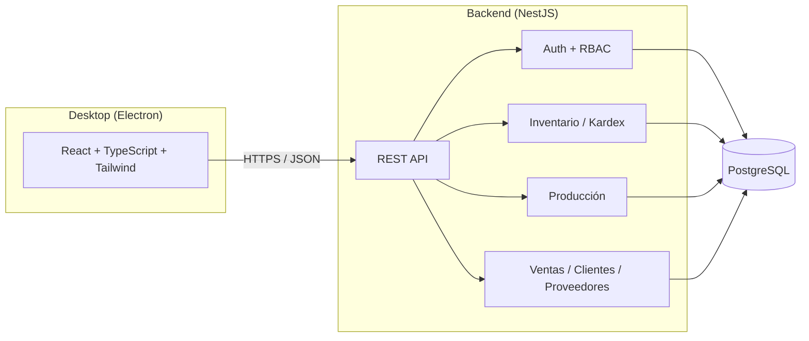

# Opera

<div align="center">


**Backend**


**Frontend / Desktop**


**Calidad y herramientas**


</div>

**Opera** — Plataforma de Gestión Operativa Empresarial: un ERP de escritorio para **inventario, producción, compras y ventas**, construido como monorepo con backend en **NestJS + Prisma + PostgreSQL** y cliente de escritorio en **Electron + React + TypeScript**.

Es un proyecto de portafolio, pero se desarrolla con las prácticas de un sistema productivo real: RBAC, trazabilidad completa de inventario (Kardex), transacciones consistentes, tests automatizados y decisiones de arquitectura documentadas.

## Índice

- [Visión](#visión)
- [¿Por qué este proyecto?](#por-qué-este-proyecto)
- [Arquitectura](#arquitectura)
- [Principios de diseño](#principios-de-diseño)
- [Stack tecnológico](#stack-tecnológico)
- [Estructura del monorepo](#estructura-del-monorepo)
- [Roadmap](#roadmap)
- [Puesta en marcha](#puesta-en-marcha)
- [Estado actual](#estado-actual)
- [Seguimiento del trabajo](#seguimiento-del-trabajo)
- [Decisiones de arquitectura (ADRs)](#decisiones-de-arquitectura-adrs)
- [Licencia](#licencia)

## Visión

Muchas pequeñas y medianas empresas manufactureras manejan su inventario y producción en hojas de cálculo, sin trazabilidad real de por qué cambió el stock, sin control de quién hizo qué, y sin una vista confiable del costo de producción. Opera busca resolver ese problema con un ERP de escritorio simple, auditable y correcto por diseño: cada movimiento de inventario queda registrado de forma permanente, cada acción queda asociada a un usuario y un rol, y el stock nunca se edita a mano — se calcula a partir de su historia.

## ¿Por qué este proyecto?

Opera es mi proyecto de portafolio para demostrar diseño de sistemas backend con reglas de negocio reales (no solo CRUDs), y las decisiones detrás de esas reglas quedan documentadas explícitamente como ADRs en vez de perderse en el código. La meta es un ERP completo y usable en producción real — inventario, producción, compras, ventas, clientes, proveedores, reportes y dashboard —, construido con la misma disciplina de ingeniería que un producto comercial: consistencia transaccional, control de acceso, auditoría y pruebas automatizadas en cada pieza que se agrega, no solo al final.

## Arquitectura



Un diagrama C4 completo (contexto + contenedores) se agregará en la fase de cierre del proyecto ([M6](#roadmap)).

## Principios de diseño

- **Kardex append-only**: los movimientos de inventario (`StockMovement`) nunca se editan ni se borran. El stock actual siempre se deriva de la suma de movimientos, nunca es un campo que se sobreescribe directamente.
- **Un solo catálogo de ítems**: productos terminados, materias primas e insumos son `Product` con distinto `type`, no tablas separadas — así `StockMovement` referencia un único `productId` y todo comparte el mismo Kardex.
- **RBAC desde la base**: todo endpoint sensible pasa por un guard de roles/permisos reutilizable, no por chequeos ad-hoc dispersos en el código.
- **Auditoría real**: cada acción relevante sobre una entidad queda registrada en `AuditLog` con el estado anterior y posterior.
- **Consistencia transaccional**: operaciones críticas (ajustes de stock, cierre de órdenes de producción) usan transacciones de Prisma con nivel de aislamiento explícito para evitar condiciones de carrera.
- **Decisiones documentadas**: cambios de arquitectura relevantes se registran como ADR, no solo en el mensaje de commit.

## Stack tecnológico

| Capa                     | Tecnología                                            |
| ------------------------ | ----------------------------------------------------- |
| Backend                  | NestJS, TypeScript, Prisma ORM                        |
| Base de datos            | PostgreSQL 16                                         |
| Autenticación            | JWT + Argon2                                          |
| Frontend / Desktop       | Electron, React, Vite, TypeScript, Tailwind CSS       |
| Formularios y validación | React Hook Form + Zod                                 |
| Estado de datos remotos  | TanStack Query                                        |
| Testing                  | Jest (unitarios/integración), Playwright (end-to-end) |
| Documentación de API     | Swagger / OpenAPI (`@nestjs/swagger`)                 |
| Calidad de código        | ESLint, Prettier, Husky, lint-staged                  |
| CI/CD                    | GitHub Actions                                        |
| Empaquetado desktop      | electron-builder                                      |
| Infraestructura local    | Docker Compose                                        |

## Estructura del monorepo

```
opera/
├── .github/
│   └── workflows/   # CI (lint + build en cada PR)
├── .husky/
│   └── pre-commit   # lint-staged (ESLint + Prettier)
├── packages/
│   ├── backend/     # API NestJS + Prisma
│   └── desktop/     # Cliente Electron + React + Vite + Tailwind
├── docs/
│   └── adr/         # Architecture Decision Records
├── docker-compose.yml
├── eslint.config.mjs
├── .env.example
├── package.json
├── pnpm-workspace.yaml
└── README.md
```

> Ver [`docs/adr/`](docs/adr/) para las decisiones de arquitectura documentadas hasta ahora.

## Roadmap

El trabajo está organizado en milestones, cada uno con sus issues de seguimiento en GitHub:

| Milestone                                                                                        | Alcance                                                                                                                       |
| ------------------------------------------------------------------------------------------------ | ----------------------------------------------------------------------------------------------------------------------------- |
| [M0 - Setup del repositorio](https://github.com/TomasPosada0626/opera/milestone/1)               | Monorepo, linting, Docker Compose, CI base                                                                                    |
| [M1 - Backend: Auth + RBAC](https://github.com/TomasPosada0626/opera/milestone/2)                | Prisma schema base, JWT + Argon2, guard RBAC, Swagger, CI con tests y `pnpm audit`                                            |
| [M2 - Inventario + Kardex](https://github.com/TomasPosada0626/opera/milestone/3)                 | Módulo insignia: bodegas/ubicaciones, Kardex append-only, transacciones consistentes, filtros reutilizables, alertas de stock |
| [M3 - Producción](https://github.com/TomasPosada0626/opera/milestone/4)                          | BOM, órdenes de producción, costeo                                                                                            |
| [M4 - Frontend Electron](https://github.com/TomasPosada0626/opera/milestone/5)                   | Cliente de escritorio, pantallas de inventario y producción                                                                   |
| [M5 - Ventas/Compras/Clientes/Proveedores](https://github.com/TomasPosada0626/opera/milestone/6) | Ventas, compras, clientes, proveedores, saldos pendientes, reportes (PDF/Excel), dashboard, búsqueda global                   |
| [M6 - Calidad y documentación](https://github.com/TomasPosada0626/opera/milestone/7)             | E2E, CI completo, ADRs, diagrama C4, revisión de seguridad final                                                              |

## Puesta en marcha

Requisitos: Node.js ≥ 24, pnpm ≥ 9, Docker.

```bash
cp .env.example .env
pnpm install

# PostgreSQL 16 local
docker compose up -d

# Cliente de Prisma (regenerar tras cualquier cambio de schema.prisma)
pnpm db:generate

# Aplica las migraciones ya commiteadas
pnpm db:deploy

# Crea el rol y usuario Administrador inicial (ver ADMIN_EMAIL/ADMIN_PASSWORD en .env)
pnpm db:seed

# Backend (NestJS) — http://localhost:3000 (docs interactivos en /docs)
pnpm dev:backend

# Desktop (Electron)
pnpm dev:desktop
```

> Si el puerto 5432 ya está en uso en tu máquina (por ejemplo, otro PostgreSQL local), ajusta `POSTGRES_PORT` y el puerto de `DATABASE_URL` en tu `.env` — ambos los lee `docker-compose.yml` y Prisma respectivamente.

## Estado actual

✅ **M0** y **M1 (Backend: Auth + RBAC)** cerrados. El backend tiene: Prisma conectado a PostgreSQL, schema de RBAC (`User`, `Role`, `Permission`) y `AuditLog` (ledger append-only) migrados; login JWT con contraseñas Argon2; guard RBAC reutilizable (`@Roles`/`@Permissions` + `RbacGuard`) que revalida contra la base de datos en cada request (no solo contra el token); CRUD de usuarios (solo Administrador) con auditoría en cada mutación; reseteo de contraseña por Administrador; seed del usuario Administrador inicial (`pnpm db:seed`); docs interactivos en `/docs` (Swagger/OpenAPI); y CI que corre lint, tests (26 tests, 6 suites), `pnpm audit` y build en cada push/PR, más Dependabot semanal. Una revisión de seguridad de cierre (`/security-review`) encontró y corrigió un hallazgo real (JWT sin revalidación — ver [issue #79](https://github.com/TomasPosada0626/opera/issues/79)).

✅ **M2 (Inventario + Kardex)** cerrado. `Warehouse` (bodegas), `Product`/`Category`/`Unit` (catálogo) y `StockMovement` (Kardex append-only, ver [ADR 0001](docs/adr/0001-kardex-append-only.md)) migrados, con CRUD completo para bodegas/categorías/unidades/productos. `GET /inventory/:productId/stock` calcula el stock actual (global y por bodega) sumando movimientos — nunca un campo editable. Los tres tipos de movimiento (`entradas`, `salidas`, `ajustes`) son ADMIN-only (único rol que existe hoy — ver revisión de seguridad más abajo); salida y ajuste comparten una transacción `Serializable` que valida que el stock resultante nunca sea negativo, sin condición de carrera entre movimientos concurrentes — probado con un test de integración real contra Postgres que dispara 10 salidas simultáneas por más de lo disponible y confirma que el stock final nunca queda mal (`pnpm test:e2e`, ya corriendo en CI con su propio Postgres). `GET /inventory/:productId/kardex` devuelve el historial de movimientos de un producto (más reciente primero, con bodega y usuario incluidos), filtrable por bodega. Paginación, orden y búsqueda son una utilidad compartida (`ListQueryDto` + `paginate()`) aplicada de forma pareja a los listados de bodegas, categorías, unidades, productos (búsqueda por nombre o SKU) y el Kardex — todos devuelven `{ data, meta }` con `page`/`pageSize`/`total`/`totalPages`. `GET /inventory/alertas/bajo-stock` reporta los productos activos cuyo stock calculado está por debajo de su `minStock` configurado (los productos sin umbral no se evalúan — `null` es "sin umbral", no "alertar en 0").

Al cerrar M2 se corrió una revisión de seguridad dedicada sobre todo el milestone (mismo patrón que [issue #79](https://github.com/TomasPosada0626/opera/issues/79) al cerrar M1) y encontró dos hallazgos reales: `entradas`/`salidas`/`ajustes` no tenían ninguna restricción de rol (cualquier JWT válido podía fabricar o drenar stock, falsificando el Kardex append-only), y el Kardex exponía el email de quien registró cada movimiento a cualquier usuario autenticado. Ambos corregidos de inmediato. La verificación e2e contra HTTP real que escribimos para probar esos fixes destapó además un bug independiente y más sutil: `JwtStrategy` comparaba `updatedAt` (con milisegundos) contra `iat` del JWT (truncado a segundos enteros), así que un usuario creado y logueado dentro del mismo segundo de reloj quedaba con su token rechazado como "obsoleto" en la siguiente request — corregido truncando ambos lados a segundos antes de comparar. La suite e2e creció de 2 a 8 specs (auth/RBAC, CRUD completo de cada módulo, flujo de inventario) y ahora hay un umbral mínimo de cobertura (`coverageThreshold` en Jest, gateado en CI) sobre la lógica de negocio — controllers/DTOs/glue de framework quedan fuera del umbral porque su corrección la prueba la suite e2e, no un mock de Prisma.

🚧 Empieza **M3 - Producción**: BOM (recetas), órdenes de producción y costeo.

## Seguimiento del trabajo

El trabajo se gestiona con GitHub Issues, Milestones y un [Project board](https://github.com/users/TomasPosada0626/projects/3):

- **Milestones** agrupan issues por fase (M0–M6, ver [Roadmap](#roadmap)).
- **Labels** describen área (`backend`, `frontend`, `infra`, `db`), tipo (`feature`, `bug`, `refactor`, `docs`, `test`, `adr`) y prioridad (`priority:high|medium|low`).
- El **Project board** refleja el estado real de cada issue (`Todo` / `In Progress` / `Done`) a medida que se completa el trabajo.

## Decisiones de arquitectura (ADRs)

Las decisiones de arquitectura significativas se documentan como ADRs en [`docs/adr/`](docs/adr/) conforme se toman:

- [0001 — Kardex como ledger append-only](docs/adr/0001-kardex-append-only.md)

Pendientes: por qué Electron en vez de una SPA servida, por qué NestJS + Prisma, método de costeo de producción (M3, M6).

## Licencia

Distribuido bajo licencia [MIT](./LICENSE).
