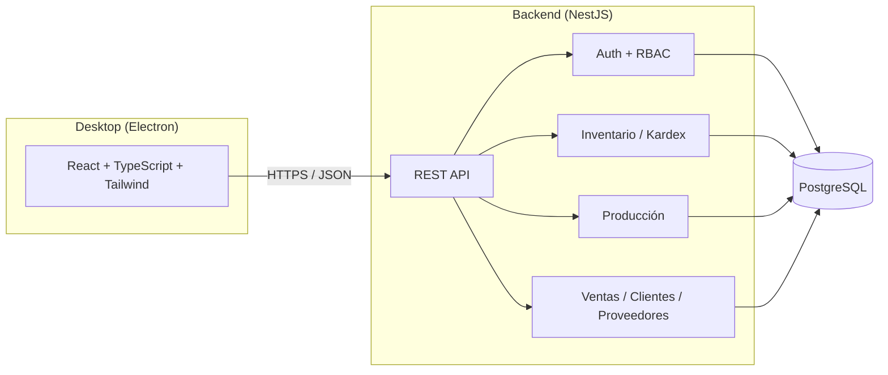

# Opera

<div align="center">


**Backend**


**Frontend / Desktop**


**Calidad y herramientas**


</div>

**Opera** — Plataforma de Gestión Operativa Empresarial: un ERP de escritorio para **inventario, producción, compras y ventas**, construido como monorepo con backend en **NestJS + Prisma + PostgreSQL** y cliente de escritorio en **Electron + React + TypeScript**.

Es un proyecto de portafolio, pero se desarrolla con las prácticas de un sistema productivo real: RBAC, trazabilidad completa de inventario (Kardex), transacciones consistentes, tests automatizados y decisiones de arquitectura documentadas.

## Índice

- [Visión](#visión)
- [¿Por qué este proyecto?](#por-qué-este-proyecto)
- [Arquitectura](#arquitectura)
- [Principios de diseño](#principios-de-diseño)
- [Stack tecnológico](#stack-tecnológico)
- [Estructura del monorepo](#estructura-del-monorepo)
- [Roadmap](#roadmap)
- [Puesta en marcha](#puesta-en-marcha)
- [Estado actual](#estado-actual)
- [Seguimiento del trabajo](#seguimiento-del-trabajo)
- [Decisiones de arquitectura (ADRs)](#decisiones-de-arquitectura-adrs)
- [Licencia](#licencia)

## Visión

Muchas pequeñas y medianas empresas manufactureras manejan su inventario y producción en hojas de cálculo, sin trazabilidad real de por qué cambió el stock, sin control de quién hizo qué, y sin una vista confiable del costo de producción. Opera busca resolver ese problema con un ERP de escritorio simple, auditable y correcto por diseño: cada movimiento de inventario queda registrado de forma permanente, cada acción queda asociada a un usuario y un rol, y el stock nunca se edita a mano — se calcula a partir de su historia.

## ¿Por qué este proyecto?

Opera es mi proyecto de portafolio para demostrar diseño de sistemas backend con reglas de negocio reales (no solo CRUDs), y las decisiones detrás de esas reglas quedan documentadas explícitamente como ADRs en vez de perderse en el código. El objetivo no es cubrir todas las funcionalidades de un ERP comercial, sino construir un subconjunto reducido con la misma disciplina de ingeniería que un producto en producción: consistencia transaccional, control de acceso, auditoría y pruebas automatizadas.

## Arquitectura



Un diagrama C4 completo (contexto + contenedores) se agregará en la fase de cierre del proyecto ([M6](#roadmap)).

## Principios de diseño

- **Kardex append-only**: los movimientos de inventario (`StockMovement`) nunca se editan ni se borran. El stock actual siempre se deriva de la suma de movimientos, nunca es un campo que se sobreescribe directamente.
- **RBAC desde la base**: todo endpoint sensible pasa por un guard de roles/permisos reutilizable, no por chequeos ad-hoc dispersos en el código.
- **Auditoría real**: cada acción relevante sobre una entidad queda registrada en `AuditLog` con el estado anterior y posterior.
- **Consistencia transaccional**: operaciones críticas (ajustes de stock, cierre de órdenes de producción) usan transacciones de Prisma con nivel de aislamiento explícito para evitar condiciones de carrera.
- **Decisiones documentadas**: cambios de arquitectura relevantes se registran como ADR, no solo en el mensaje de commit.

## Stack tecnológico

| Capa                     | Tecnología                                            |
| ------------------------ | ----------------------------------------------------- |
| Backend                  | NestJS, TypeScript, Prisma ORM                        |
| Base de datos            | PostgreSQL 16                                         |
| Autenticación            | JWT + Argon2                                          |
| Frontend / Desktop       | Electron, React, Vite, TypeScript, Tailwind CSS       |
| Formularios y validación | React Hook Form + Zod                                 |
| Estado de datos remotos  | TanStack Query                                        |
| Testing                  | Jest (unitarios/integración), Playwright (end-to-end) |
| Calidad de código        | ESLint, Prettier, Husky, lint-staged                  |
| CI/CD                    | GitHub Actions                                        |
| Empaquetado desktop      | electron-builder                                      |
| Infraestructura local    | Docker Compose                                        |

## Estructura del monorepo

```
opera/
├── .github/
│   └── workflows/   # CI (lint + build en cada PR)
├── .husky/
│   └── pre-commit   # lint-staged (ESLint + Prettier)
├── packages/
│   ├── backend/     # API NestJS + Prisma
│   └── desktop/     # Cliente Electron + React + Vite + Tailwind
├── docs/
│   └── adr/         # Architecture Decision Records
├── docker-compose.yml
├── eslint.config.mjs
├── .env.example
├── package.json
├── pnpm-workspace.yaml
└── README.md
```

> `docs/adr/` todavía no existe; se agrega cuando se documente la primera decisión de arquitectura (ver [M2](#roadmap)).

## Roadmap

El trabajo está organizado en milestones, cada uno con sus issues de seguimiento en GitHub:

| Milestone                                                                                | Alcance                                                         |
| ---------------------------------------------------------------------------------------- | --------------------------------------------------------------- |
| [M0 - Setup del repositorio](https://github.com/TomasPosada0626/opera/milestone/1)       | Monorepo, linting, Docker Compose, CI base                      |
| [M1 - Backend: Auth + RBAC](https://github.com/TomasPosada0626/opera/milestone/2)        | Prisma schema base, JWT + Argon2, guard RBAC, Swagger           |
| [M2 - Inventario + Kardex](https://github.com/TomasPosada0626/opera/milestone/3)         | Módulo insignia: Kardex append-only, transacciones consistentes |
| [M3 - Producción](https://github.com/TomasPosada0626/opera/milestone/4)                  | BOM, órdenes de producción, costeo                              |
| [M4 - Frontend Electron](https://github.com/TomasPosada0626/opera/milestone/5)           | Cliente de escritorio, pantallas de inventario y producción     |
| [M5 - Ventas/Clientes/Proveedores](https://github.com/TomasPosada0626/opera/milestone/6) | Módulos CRUD estándar y reportes                                |
| [M6 - Calidad y documentación](https://github.com/TomasPosada0626/opera/milestone/7)     | E2E, CI completo, ADRs, diagrama C4                             |

## Puesta en marcha

Requisitos: Node.js ≥ 20, pnpm ≥ 9, Docker.

```bash
cp .env.example .env
pnpm install

# PostgreSQL 16 local
docker compose up -d

# Cliente de Prisma (regenerar tras cualquier cambio de schema.prisma)
pnpm db:generate

# Backend (NestJS) — http://localhost:3000
pnpm dev:backend

# Desktop (Electron)
pnpm dev:desktop
```

> Si el puerto 5432 ya está en uso en tu máquina (por ejemplo, otro PostgreSQL local), ajusta `POSTGRES_PORT` y el puerto de `DATABASE_URL` en tu `.env` — ambos los lee `docker-compose.yml` y Prisma respectivamente.

## Estado actual

🚧 En **M1 - Backend: Auth + RBAC**. M0 (monorepo, ESLint+Prettier+Husky+lint-staged, CI, Docker Compose) está cerrado. Prisma ya está instalado y conectado a PostgreSQL vía `PrismaService`; falta el resto de M1: schema base (User/Role/Permission, AuditLog), auth JWT+Argon2, guard RBAC y Swagger.

## Seguimiento del trabajo

El trabajo se gestiona con GitHub Issues, Milestones y un [Project board](https://github.com/users/TomasPosada0626/projects/3):

- **Milestones** agrupan issues por fase (M0–M6, ver [Roadmap](#roadmap)).
- **Labels** describen área (`backend`, `frontend`, `infra`, `db`), tipo (`feature`, `bug`, `refactor`, `docs`, `test`, `adr`) y prioridad (`priority:high|medium|low`).
- El **Project board** refleja el estado real de cada issue (`Todo` / `In Progress` / `Done`) a medida que se completa el trabajo.

## Decisiones de arquitectura (ADRs)

Las decisiones de arquitectura significativas (por qué Kardex append-only, por qué Electron en vez de una SPA servida, por qué NestJS + Prisma, método de costeo de producción) se documentarán como ADRs en `docs/adr/` conforme se tomen, según lo planeado en M2, M3 y M6.

## Licencia

Distribuido bajo licencia [MIT](./LICENSE).
