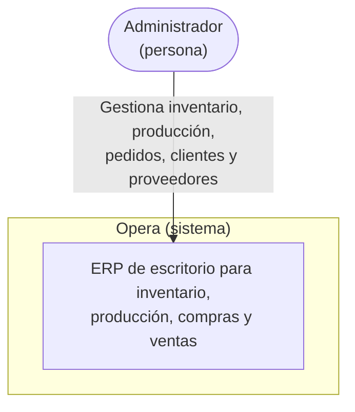

# Opera

<div align="center">


-brightgreen?style=flat-square>)

<!-- Umbrales del gate de cobertura en CI (pnpm test:cov), no un reporte en
     vivo -- ver "Test (unit, with coverage gate)" en ci.yml. Backend:
     jest.config coverageThreshold; Desktop: vite.config.mts coverage.thresholds. -->


**Backend**


**Frontend / Desktop**


**Calidad y herramientas**


</div>

**Opera** — Plataforma de Gestión Operativa Empresarial: un ERP de escritorio para **inventario, producción, compras y ventas**, construido como monorepo con backend en **NestJS + Prisma + PostgreSQL** y cliente de escritorio en **Electron + React + TypeScript**.

Es un proyecto de portafolio, pero se desarrolla con las prácticas de un sistema productivo real: RBAC, trazabilidad completa de inventario (Kardex), transacciones consistentes, tests automatizados y decisiones de arquitectura documentadas.

## Índice

- [Visión](#visión)
- [¿Por qué este proyecto?](#por-qué-este-proyecto)
- [Arquitectura](#arquitectura)
- [Principios de diseño](#principios-de-diseño)
- [Stack tecnológico](#stack-tecnológico)
- [Estructura del monorepo](#estructura-del-monorepo)
- [Roadmap](#roadmap)
- [Puesta en marcha](#puesta-en-marcha)
- [Respaldo y restauración](#respaldo-y-restauración)
- [Pruebas](#pruebas)
- [Compilación](#compilación)
- [Solución de problemas comunes](#solución-de-problemas-comunes)
- [Modelo de dominio](#modelo-de-dominio)
- [Módulos](#módulos)
- [Decisiones de arquitectura (ADRs)](#decisiones-de-arquitectura-adrs)
- [Changelog](#changelog)
- [Licencia](#licencia)

## Visión

Muchas pequeñas y medianas empresas manufactureras manejan su inventario y producción en hojas de cálculo, sin trazabilidad real de por qué cambió el stock, sin control de quién hizo qué, y sin una vista confiable del costo de producción. Opera busca resolver ese problema con un ERP de escritorio simple, auditable y correcto por diseño: cada movimiento de inventario queda registrado de forma permanente, cada acción queda asociada a un usuario y un rol, y el stock nunca se edita a mano — se calcula a partir de su historia.

## ¿Por qué este proyecto?

Opera es mi proyecto de portafolio para demostrar diseño de sistemas backend con reglas de negocio reales (no solo CRUDs), y las decisiones detrás de esas reglas quedan documentadas explícitamente como ADRs en vez de perderse en el código. La meta es un ERP completo y usable en producción real — inventario, producción, compras, ventas, clientes, proveedores, reportes y dashboard —, construido con la misma disciplina de ingeniería que un producto comercial: consistencia transaccional, control de acceso, auditoría y pruebas automatizadas en cada pieza que se agrega, no solo al final.

## Arquitectura

### Diagrama de contexto (C4 nivel 1)

Opera es un sistema cerrado: un solo tipo de usuario (el Administrador del
taller) opera todo el ERP, y no hay integraciones con sistemas externos —
sin pasarela de pagos, sin proveedor de correo, sin ERP externo del que
importar/exportar datos. Esa ausencia es deliberada, no un hueco: cada
dato que el negocio necesita (clientes, proveedores, inventario, ventas) se
gestiona dentro del propio sistema.



### Diagrama de contenedores (C4 nivel 2)


Este diagrama muestra el plano de datos (cómo se hablan los tres
contenedores), no el de control: en el instalador autocontenido (ver
[ADR 0008](docs/adr/0008-instalador-autocontenido-docker-desktop.md)),
**Desktop además administra el ciclo de vida de API y de la base de
datos** — los prende (`docker run`/`docker start`, `spawn` del backend) al
abrir Opera y los apaga al cerrarla — algo que este diagrama no representa
porque describe la arquitectura en ejecución, no quién la orquesta.

Dentro del contenedor **API REST**, el backend se organiza en módulos de Nest
por dominio (Auth, Inventario, Producción, Ventas/Clientes/Proveedores,
Reportes/Dashboard) — ver el detalle a nivel de componente en
[Estructura del monorepo](#estructura-del-monorepo) y el desglose de módulos en
la tabla de [Stack tecnológico](#stack-tecnológico); no se duplica aquí un
tercer diagrama (C4 nivel 3) porque la lista de módulos en
`packages/backend/src/app.module.ts` ya cumple ese rol sin necesitar
mantenerse en dos lugares a la vez.

## Principios de diseño

- **Kardex append-only**: los movimientos de inventario (`StockMovement`) nunca se editan ni se borran. El stock actual siempre se deriva de la suma de movimientos, nunca es un campo que se sobreescribe directamente.
- **Un solo catálogo de ítems**: productos terminados, materias primas e insumos son `Product` con distinto `type`, no tablas separadas — así `StockMovement` referencia un único `productId` y todo comparte el mismo Kardex.
- **RBAC desde la base**: todo endpoint sensible pasa por un guard de roles/permisos reutilizable, no por chequeos ad-hoc dispersos en el código.
- **Auditoría real**: cada acción relevante sobre una entidad queda registrada en `AuditLog` con el estado anterior y posterior.
- **Consistencia transaccional**: operaciones críticas (ajustes de stock, cierre de órdenes de producción) usan transacciones de Prisma con nivel de aislamiento explícito para evitar condiciones de carrera.
- **Decisiones documentadas**: cambios de arquitectura relevantes se registran como ADR, no solo en el mensaje de commit.

## Stack tecnológico

| Capa                     | Tecnología                                            |
| ------------------------ | ----------------------------------------------------- |
| Backend                  | NestJS, TypeScript, Prisma ORM                        |
| Base de datos            | PostgreSQL 16                                         |
| Autenticación            | JWT + Argon2                                          |
| Frontend / Desktop       | Electron, React, Vite, TypeScript, Tailwind CSS       |
| Formularios y validación | React Hook Form + Zod                                 |
| Estado de datos remotos  | TanStack Query                                        |
| Testing                  | Jest (unitarios/integración), Playwright (end-to-end) |
| Documentación de API     | Swagger / OpenAPI (`@nestjs/swagger`)                 |
| Generación de documentos | PDF (`pdfkit`)                                        |
| Envío de correo          | SMTP (`nodemailer`)                                   |
| Calidad de código        | ESLint (+ `jsx-a11y`), Prettier, Husky, lint-staged   |
| CI/CD                    | GitHub Actions                                        |
| Empaquetado desktop      | electron-builder                                      |
| Infraestructura local    | Docker Compose                                        |

## Estructura del monorepo

```
opera/
├── .github/
│   └── workflows/   # CI (lint + build en cada PR)
├── .husky/
│   └── pre-commit   # lint-staged (ESLint + Prettier)
├── packages/
│   ├── backend/     # API NestJS + Prisma
│   └── desktop/     # Cliente Electron + React + Vite + Tailwind
├── docs/
│   └── adr/         # Architecture Decision Records
├── docker-compose.yml
├── eslint.config.mjs
├── .env.example
├── package.json
├── pnpm-workspace.yaml
└── README.md
```

> Ver [`docs/adr/`](docs/adr/) para las decisiones de arquitectura documentadas hasta ahora.

## Roadmap

El trabajo está organizado en milestones, cada uno con sus issues de seguimiento en GitHub. **Avance: 94/94 issues cerradas (100%), 7 de 7 milestones completos.** Ese número no pesa parejo: M5 por sí sola son 26 issues que agregan cuatro dominios de negocio nuevos completos (clientes, proveedores, ventas/remisiones con estado de pago) — en esfuerzo real es más cercano al 50-55% del proyecto total.

| Milestone                                                                                        | Alcance                                                                                                                       | Estado   |
| ------------------------------------------------------------------------------------------------ | ----------------------------------------------------------------------------------------------------------------------------- | -------- |
| [M0 - Setup del repositorio](https://github.com/TomasPosada0626/opera/milestone/1)               | Monorepo, linting, Docker Compose, CI base                                                                                    | ✅ 6/6   |
| [M1 - Backend: Auth + RBAC](https://github.com/TomasPosada0626/opera/milestone/2)                | Prisma schema base, JWT + Argon2, guard RBAC, Swagger, CI con tests y `pnpm audit`                                            | ✅ 13/13 |
| [M2 - Inventario + Kardex](https://github.com/TomasPosada0626/opera/milestone/3)                 | Módulo insignia: bodegas/ubicaciones, Kardex append-only, transacciones consistentes, filtros reutilizables, alertas de stock | ✅ 15/15 |
| [M3 - Producción](https://github.com/TomasPosada0626/opera/milestone/4)                          | BOM, órdenes de producción, costeo                                                                                            | ✅ 8/8   |
| [M4 - Frontend Electron](https://github.com/TomasPosada0626/opera/milestone/5)                   | Cliente de escritorio, pantallas de inventario y producción                                                                   | ✅ 18/18 |
| [M5 - Ventas/Compras/Clientes/Proveedores](https://github.com/TomasPosada0626/opera/milestone/6) | Ventas, compras, clientes, proveedores, saldos pendientes, reportes (PDF/Excel), dashboard, búsqueda global                   | ✅ 26/26 |
| [M6 - Calidad y documentación](https://github.com/TomasPosada0626/opera/milestone/7)             | E2E, CI completo, ADRs, diagrama C4, revisión de seguridad final                                                              | ✅ 7/7   |

## Puesta en marcha

Requisitos: Node.js ≥ 24, pnpm ≥ 9, Docker.

```bash
cp .env.example .env
pnpm install

# PostgreSQL 16 local
docker compose up -d

# Cliente de Prisma (regenerar tras cualquier cambio de schema.prisma)
pnpm db:generate

# Aplica las migraciones ya commiteadas
pnpm db:deploy

# Crea el rol y usuario Administrador inicial (ver ADMIN_EMAIL/ADMIN_PASSWORD en .env)
pnpm db:seed

# Backend (NestJS) — http://localhost:3000 (docs interactivos en /docs)
pnpm dev:backend

# Desktop (Electron)
pnpm dev:desktop
```

> Si el puerto 5432 ya está en uso en tu máquina (por ejemplo, otro PostgreSQL local), ajusta `POSTGRES_PORT` y el puerto de `DATABASE_URL` en tu `.env` — ambos los lee `docker-compose.yml` y Prisma respectivamente.

Con el backend y el desktop corriendo, entra a la app y usa las credenciales que definiste en `ADMIN_EMAIL`/`ADMIN_PASSWORD` (las que `pnpm db:seed` usó para crear el Administrador inicial) en la pantalla de login. Es la única cuenta que existe hasta que crees más desde **Usuarios** dentro de la propia app.

> **"¿Olvidaste tu contraseña?"** en la pantalla de login manda un código de verificación de 6 dígitos por correo (vence en 15 minutos, un solo uso). Necesita las variables `SMTP_*` configuradas en `.env` (ver `.env.example`) — sin ellas, el endpoint sigue respondiendo con éxito (nunca revela si un correo existe) pero no manda nada, y queda un warning en el log del backend.

## Respaldo y restauración

`docker-compose.yml` guarda los datos de PostgreSQL en un volumen con nombre
(`opera_postgres_data`), que sobrevive a reinicios del contenedor — pero no
protege contra un disco dañado, un `docker volume rm` accidental o
reinstalar el host. Opera es el sistema de registro real de
inventario/producción/ventas de la empresa: respaldar la base es
responsabilidad de quien la opera, no algo opcional.

```bash
# Respalda la base a backups/opera-<fecha>.sql.gz (comprimido, fuera del
# repo — ver .gitignore) y borra respaldos locales de más de 30 días.
pnpm --filter backend backup:db

# Retención distinta (en días)
pnpm --filter backend backup:db -- --retain-days=7
```

Córrelo con el contenedor `opera-postgres` arriba (`docker compose up -d`).
No sube a ningún destino remoto a propósito — LAN-only, igual que el resto
del proyecto; para retención real, programa este comando (cron, Task
Scheduler) y copia `backups/` a donde ya respaldes el resto de la empresa.

**Instalador empaquetado**: el Postgres que administra `backend-manager.ts`
corre en un contenedor con nombre distinto (`opera-postgres-app`, ver
[ADR 0008](docs/adr/0008-instalador-autocontenido-docker-desktop.md)) — para
respaldar esa instalación, pasá el nombre por variable de entorno:

```bash
POSTGRES_CONTAINER=opera-postgres-app pnpm --filter backend backup:db
```

Restaurar un respaldo (sobrescribe la base actual — cambiá `opera-postgres`
por `opera-postgres-app` si es una instalación del instalador empaquetado):

```bash
gunzip -c backups/opera-<fecha>.sql.gz | docker exec -i opera-postgres psql -U opera -d opera
```

## Pruebas

```bash
# Backend: unitarios + integración (Prisma mockeado, no necesita Postgres corriendo)
pnpm --filter backend test

# Backend: e2e contra Postgres real (requiere `docker compose up -d`)
pnpm --filter backend test:e2e

# Desktop: unitarios (Vitest + Testing Library)
pnpm --filter desktop test

# Desktop: e2e (Playwright — requiere el backend real corriendo en :3000;
# Vite se levanta solo). Solo la primera vez:
pnpm --filter desktop exec playwright install chromium
pnpm --filter desktop test:e2e

# Todo el monorepo (solo unitarios de ambos paquetes — atajo local, no
# el pipeline completo: CI en cada push/PR a main además corre lint,
# format check, ambas suites e2e (backend contra Postgres real y
# Playwright contra el backend real) y el build de los dos paquetes —
# ver .github/workflows/ci.yml)
pnpm test
```

Pruebas de carga (k6, dataset sintético multi-año, latencia de
Kardex/reportes/dashboard a escala): ver
[`packages/backend/load-tests/README.md`](packages/backend/load-tests/README.md).

## Compilación

```bash
pnpm build
```

Compila ambos paquetes y arma un instalador de Windows autocontenido en `packages/desktop/release/`: el script `build` del desktop primero empaqueta el backend entero (`pnpm --filter backend deploy`, con `node_modules` de producción resueltos) como recurso embebido, descarga y verifica (SHA256 contra el checksum que publica Docker) el instalador oficial de Docker Desktop la primera vez que se corre (después queda cacheado en `packages/desktop/resources/`, nunca se commitea), y recién ahí corre `tsc && vite build && electron-builder`.

El instalador resultante pide permisos de administrador desde que arranca (necesarios para activar WSL/Virtual Machine Platform e instalar Docker Desktop si hace falta) y, al abrir Opera instalado, la propia app levanta y apaga Postgres y el backend en segundo plano — no hay `.env` ni `pnpm db:seed` que correr a mano en la máquina final: la primera vez que se abre sin ningún usuario todavía, muestra una pantalla para crear la cuenta de Administrador ahí mismo, guardada solo en esa base de datos local. Pesa varios cientos de MB sin firmar (Docker Desktop embebido más el backend con `node_modules` de producción) — el número exacto varía de build a build (ver el tamaño real del `.exe` publicado en cada [Release de GitHub](https://github.com/TomasPosada0626/opera/releases)); ver [ADR 0008](docs/adr/0008-instalador-autocontenido-docker-desktop.md) para el detalle de qué incluye.

### Firmar el instalador

Sin firmar, Windows SmartScreen marca el instalador como "editor desconocido" y no hay forma de verificar que no fue alterado. Opera se distribuye a una sola máquina (no públicamente), así que un certificado real (OV/EV, de pago, requiere verificar una identidad legal) es una inversión que no tiene sentido para este modelo — un certificado auto-firmado, confiado a mano en esa única máquina, resuelve el mismo problema sin ese costo:

```powershell
cd packages/desktop
./scripts/generate-self-signed-cert.ps1
```

Genera `packages/desktop/certs/opera-code-signing.pfx` (privado, gitignored) y `.cer` (público). Para firmar, exporta las variables que el script te muestra antes de compilar:

```powershell
$env:CSC_LINK = "<ruta al .pfx>"
$env:CSC_KEY_PASSWORD = "<la contraseña que usaste>"
pnpm build
```

`electron-builder` firma automáticamente cuando esas dos variables están presentes — sin ellas, sigue compilando igual, solo sin firmar. En la máquina donde se instala Opera, copia el `.cer` (nunca el `.pfx`) y corre como Administrador:

```powershell
Import-Certificate -FilePath .\opera-code-signing.cer -CertStoreLocation Cert:\LocalMachine\TrustedPublisher
```

Desde ahí, ese instalador específico deja de disparar la advertencia de SmartScreen en esa máquina.

### Publicar una nueva versión (actualización automática)

El cliente de escritorio revisa GitHub Releases al arrancar (cada 6 horas mientras sigue abierto) y, si hay una versión nueva, la descarga en segundo plano y avisa con un banner ("Reiniciar y actualizar") — sin interrumpir a quien está trabajando, y sin fallar de forma visible si no hay internet (Opera es LAN-first, el chequeo de actualización es la única parte que sí necesita salir a internet, y lo hace en silencio si no puede).

Para publicar una versión nueva:

1. Sube la versión en `packages/desktop/package.json`.
2. Genera un [token de GitHub](https://github.com/settings/tokens) con permiso `repo` (o un fine-grained token con `contents: write` sobre este repo) y expórtalo como `GH_TOKEN`.
3. Corre `pnpm --filter desktop release` — compila, empaqueta, y sube el instalador como un GitHub Release con los metadatos que `electron-updater` necesita.

El repo es público, así que el chequeo y la descarga de actualizaciones no necesitan ningún token embebido en la app que se distribuye — `GH_TOKEN` solo hace falta del lado de quien publica.

## Solución de problemas comunes

- **`EPERM: operation not permitted` al renombrar `query_engine-*.dll.node`** (Windows, al correr `pnpm install` o `prisma generate`): algún proceso todavía tiene el motor de Prisma cargado — casi siempre un backend (`pnpm dev:backend`) que quedó corriendo en otra terminal. Ciérralo y reintenta.
- **Puerto 5432 o 3000 ya en uso**: ver la nota de `POSTGRES_PORT`/`DATABASE_URL` arriba para Postgres; para el backend, ajusta `PORT` en `.env` (y `VITE_API_URL` en el entorno del desktop si el backend no corre en `localhost:3000`).
- **`prisma migrate dev` pide confirmación y no avanza**: en un entorno no interactivo (CI, algunos shells embebidos) usa `prisma migrate diff --from-url "$DATABASE_URL" --to-schema-datamodel prisma/schema.prisma --script` para generar el SQL a mano, revísalo, y aplícalo con `prisma migrate deploy` en vez de `migrate dev`.

**Instalador empaquetado** (ver [ADR 0008](docs/adr/0008-instalador-autocontenido-docker-desktop.md)):

- **Docker Desktop no arranca después de instalar Opera**: si la PC no tenía WSL/Virtual Machine Platform activado, Windows se reinició solo durante la instalación y Docker Desktop puede tardar un minuto en terminar de arrancar tras ese reinicio — esperá y volvé a abrir Opera. Si sigue sin arrancar, la causa más común es que la virtualización (Intel VT-x/AMD-V) esté desactivada en el BIOS/UEFI.
- **No encuentro el Postgres de Opera en el puerto de siempre**: el Postgres que administra el instalador empaquetado corre en el puerto `5433` (contenedor `opera-postgres-app`), no en el `5432` de `docker-compose.yml` (dev) — a propósito, para que nunca colisionen en la misma PC.
- **¿Dónde queda el registro de errores o el `JWT_SECRET` de una instalación empaquetada?** En `app.getPath('userData')` de Electron (`%APPDATA%\Opera` en Windows) — `logs/opera-desktop.log` y `opera-secrets.json` respectivamente. La app tiene un botón para exportar el log de errores sin tener que ir a buscarlo a mano.

## Modelo de dominio

Las entidades centrales y las invariantes reales que el sistema hace cumplir por construcción, no por convención:

**Catálogo.** `Product` es un catálogo único (`type`: `FINISHED_GOOD` / `RAW_MATERIAL` / `SUPPLY`) — materia prima, insumos y terminados son la misma tabla con distinto tipo, no tablas separadas, así que `StockMovement` referencia un único `productId` y todo el Kardex es uno solo. `Category`, `Unit` y `Warehouse` son catálogos de apoyo con soft-delete (`isActive`), nunca borrado físico.

**Kardex (`StockMovement`).** Ledger append-only — nunca se edita ni se borra una fila (ver [ADR 0001](docs/adr/0001-kardex-append-only.md)). El stock actual de un producto en una bodega es siempre `SUM(quantity)` de sus movimientos, nunca un campo que se escribe directamente. Toda corrección es una entrada nueva que revierte, no una edición de la original. Movimientos manuales (`ENTRADA`/`SALIDA`/`AJUSTE`) y los generados por otros módulos (producción, remisiones) comparten esta misma tabla.

**Producción.** `BillOfMaterials` (una receta activa por producto terminado, no versionada — una orden completada queda registrada como movimientos reales, no como referencia a "qué receta se usó") y `ProductionOrder` (`PENDIENTE` → `COMPLETADA`/`CANCELADA`). Completar una orden es una única transacción `Serializable`: revalida stock de cada componente, escribe una `SALIDA` por componente consumido y una `ENTRADA` del terminado, y calcula costo por promedio ponderado ([ADR 0002](docs/adr/0002-costeo-promedio-ponderado.md)) — todo o nada.

**Ventas: fabricación sobre pedido.** `Order` (`PENDIENTE` → `EN_PRODUCCION` → `EN_ALMACEN`, o `CANCELADO`) declara la intención de venta sin tocar stock — no hay inventario de terminado esperando venta, cada pedido se fabrica después de crearse. El stock del terminado entra al pasar a `EN_ALMACEN`. `Remission` (nota de remisión, con consecutivo autoincremental) es el hecho real de despacho: solo se puede crear contra un pedido `EN_ALMACEN`, valida que la cantidad remisionada no exceda lo pedido (acumulando líneas repetidas de la misma solicitud) ni el stock físico disponible, y genera la `SALIDA` real. Una remisión nunca se edita — corregirla es anularla (`voidedAt`/`voidReason`) y escribir una `ENTRADA` de reverso, dejando el historial completo e intacto. El estado de pago (`PAGADO`/`ABONADO`/`CARTERA`) es independiente del despacho y nunca aparece en el PDF/impresión que ve el cliente.

**Compras.** `Supplier`, `SupplierProduct` (precio vigente por par proveedor/producto) y `SupplierPurchase` (bitácora de qué se pidió, cuándo y a qué costo, con bodega de destino). Registrar la compra no mueve stock por sí solo — es solo la bitácora. Un `POST /supplier-purchases/:id/receive` explícito concilia "lo pedido" contra "lo que de verdad entró": dentro de una transacción con guard atómico contra doble-recepción, escribe una `ENTRADA` real por la cantidad completa y enlaza la compra a ese movimiento (`stockMovementId`). No admite recepciones parciales — el mismo criterio de scope que el resto del dominio (ver `Order`/`Remission`).

**Clientes.** `Customer` con saldo pendiente calculado a partir de sus remisiones no anuladas y su estado de pago — nunca un campo de saldo que se actualiza a mano.

**Seguridad y auditoría.** `User`/`Role`/`Permission` (RBAC dinámico — hoy solo existe el rol `ADMIN`, el schema soporta más sin migración). El guard revalida contra la base de datos en cada request, no solo contra el JWT — un cambio de rol o una cuenta desactivada surte efecto de inmediato, no cuando expire el token. `AuditLog` registra estado anterior/posterior de cada mutación relevante — un ledger propio, con el mismo espíritu append-only que el Kardex.

## Módulos

| Módulo              | Qué hace                                                                                                                                                                         |
| ------------------- | -------------------------------------------------------------------------------------------------------------------------------------------------------------------------------- |
| **Inventario**      | Bodegas, catálogo (productos/categorías/unidades), Kardex por producto/bodega, entradas/salidas/ajustes manuales, alertas de stock bajo.                                         |
| **Producción**      | Recetas (BOM), órdenes de producción, costeo por promedio ponderado, cierre atómico que mueve el Kardex.                                                                         |
| **Ventas**          | Pedidos con ciclo de vida completo (pendiente → producción → almacén), remisiones con consecutivo, impresión y descarga en PDF, anulación con reverso, estado de pago y cartera. |
| **Compras**         | Proveedores, precio por producto, bitácora de compras, recepción que concilia lo pedido contra el Kardex real.                                                                   |
| **Clientes**        | CRUD, saldo pendiente derivado de remisiones.                                                                                                                                    |
| **Reportes**        | Inventario valorizado, ventas por rango de fecha, productos más vendidos — cada uno exportable a PDF/Excel.                                                                      |
| **Dashboard**       | KPIs agregados de todos los módulos en un solo endpoint.                                                                                                                         |
| **Búsqueda global** | Salto rápido por término a través de productos, clientes, proveedores, remisiones y órdenes de producción.                                                                       |
| **Usuarios**        | CRUD, reseteo de contraseña, RBAC.                                                                                                                                               |
| **Observabilidad**  | Logs estructurados con id de correlación (backend), captura de errores exportable (desktop), `/health` con verificación real de Postgres.                                        |

## Decisiones de arquitectura (ADRs)

Las decisiones de arquitectura significativas se documentan como ADRs en [`docs/adr/`](docs/adr/) conforme se toman:

- [0001 — Kardex como ledger append-only](docs/adr/0001-kardex-append-only.md)
- [0002 — Costeo de producción por promedio ponderado](docs/adr/0002-costeo-promedio-ponderado.md)
- [0003 — Cliente de escritorio Electron sobre una SPA servida](docs/adr/0003-electron-sobre-spa-servida.md)
- [0004 — NestJS + Prisma sobre otras alternativas de backend](docs/adr/0004-nestjs-prisma-sobre-alternativas.md)
- [0005 — No migrar a Clean Architecture / DDD táctico](docs/adr/0005-no-clean-architecture.md)
- [0006 — Retención y archivado de AuditLog y StockMovement](docs/adr/0006-retencion-auditlog-stockmovement.md)
- [0007 — Sin TLS en HTTP local ni SSL en la conexión a Postgres](docs/adr/0007-sin-tls-lan-de-confianza.md)
- [0008 — Instalador autocontenido con Docker Desktop embebido](docs/adr/0008-instalador-autocontenido-docker-desktop.md)

## Changelog

Cambios notables por versión en [`CHANGELOG.md`](CHANGELOG.md).

## Licencia

Distribuido bajo licencia [MIT](./LICENSE).
