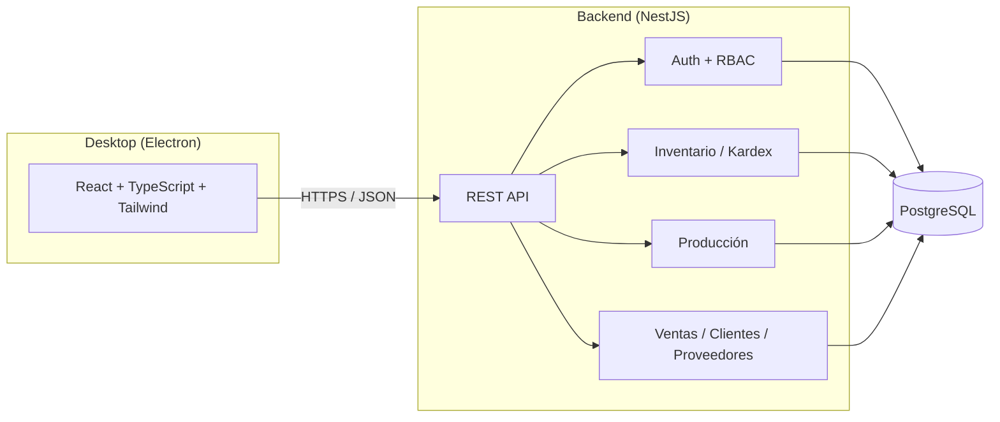

# Opera

<div align="center">


**Backend**


**Frontend / Desktop**


**Calidad y herramientas**


</div>

**Opera** — Plataforma de Gestión Operativa Empresarial: un ERP de escritorio para **inventario, producción, compras y ventas**, construido como monorepo con backend en **NestJS + Prisma + PostgreSQL** y cliente de escritorio en **Electron + React + TypeScript**.

Es un proyecto de portafolio, pero se desarrolla con las prácticas de un sistema productivo real: RBAC, trazabilidad completa de inventario (Kardex), transacciones consistentes, tests automatizados y decisiones de arquitectura documentadas.

## Índice

- [Visión](#visión)
- [¿Por qué este proyecto?](#por-qué-este-proyecto)
- [Arquitectura](#arquitectura)
- [Principios de diseño](#principios-de-diseño)
- [Stack tecnológico](#stack-tecnológico)
- [Estructura del monorepo](#estructura-del-monorepo)
- [Roadmap](#roadmap)
- [Puesta en marcha](#puesta-en-marcha)
- [Estado actual](#estado-actual)
- [Seguimiento del trabajo](#seguimiento-del-trabajo)
- [Decisiones de arquitectura (ADRs)](#decisiones-de-arquitectura-adrs)
- [Licencia](#licencia)

## Visión

Muchas pequeñas y medianas empresas manufactureras manejan su inventario y producción en hojas de cálculo, sin trazabilidad real de por qué cambió el stock, sin control de quién hizo qué, y sin una vista confiable del costo de producción. Opera busca resolver ese problema con un ERP de escritorio simple, auditable y correcto por diseño: cada movimiento de inventario queda registrado de forma permanente, cada acción queda asociada a un usuario y un rol, y el stock nunca se edita a mano — se calcula a partir de su historia.

## ¿Por qué este proyecto?

Opera es mi proyecto de portafolio para demostrar diseño de sistemas backend con reglas de negocio reales (no solo CRUDs), y las decisiones detrás de esas reglas quedan documentadas explícitamente como ADRs en vez de perderse en el código. La meta es un ERP completo y usable en producción real — inventario, producción, compras, ventas, clientes, proveedores, reportes y dashboard —, construido con la misma disciplina de ingeniería que un producto comercial: consistencia transaccional, control de acceso, auditoría y pruebas automatizadas en cada pieza que se agrega, no solo al final.

## Arquitectura



Un diagrama C4 completo (contexto + contenedores) se agregará en la fase de cierre del proyecto ([M6](#roadmap)).

## Principios de diseño

- **Kardex append-only**: los movimientos de inventario (`StockMovement`) nunca se editan ni se borran. El stock actual siempre se deriva de la suma de movimientos, nunca es un campo que se sobreescribe directamente.
- **Un solo catálogo de ítems**: productos terminados, materias primas e insumos son `Product` con distinto `type`, no tablas separadas — así `StockMovement` referencia un único `productId` y todo comparte el mismo Kardex.
- **RBAC desde la base**: todo endpoint sensible pasa por un guard de roles/permisos reutilizable, no por chequeos ad-hoc dispersos en el código.
- **Auditoría real**: cada acción relevante sobre una entidad queda registrada en `AuditLog` con el estado anterior y posterior.
- **Consistencia transaccional**: operaciones críticas (ajustes de stock, cierre de órdenes de producción) usan transacciones de Prisma con nivel de aislamiento explícito para evitar condiciones de carrera.
- **Decisiones documentadas**: cambios de arquitectura relevantes se registran como ADR, no solo en el mensaje de commit.

## Stack tecnológico

| Capa                     | Tecnología                                            |
| ------------------------ | ----------------------------------------------------- |
| Backend                  | NestJS, TypeScript, Prisma ORM                        |
| Base de datos            | PostgreSQL 16                                         |
| Autenticación            | JWT + Argon2                                          |
| Frontend / Desktop       | Electron, React, Vite, TypeScript, Tailwind CSS       |
| Formularios y validación | React Hook Form + Zod                                 |
| Estado de datos remotos  | TanStack Query                                        |
| Testing                  | Jest (unitarios/integración), Playwright (end-to-end) |
| Documentación de API     | Swagger / OpenAPI (`@nestjs/swagger`)                 |
| Calidad de código        | ESLint, Prettier, Husky, lint-staged                  |
| CI/CD                    | GitHub Actions                                        |
| Empaquetado desktop      | electron-builder                                      |
| Infraestructura local    | Docker Compose                                        |

## Estructura del monorepo

```
opera/
├── .github/
│   └── workflows/   # CI (lint + build en cada PR)
├── .husky/
│   └── pre-commit   # lint-staged (ESLint + Prettier)
├── packages/
│   ├── backend/     # API NestJS + Prisma
│   └── desktop/     # Cliente Electron + React + Vite + Tailwind
├── docs/
│   └── adr/         # Architecture Decision Records
├── docker-compose.yml
├── eslint.config.mjs
├── .env.example
├── package.json
├── pnpm-workspace.yaml
└── README.md
```

> Ver [`docs/adr/`](docs/adr/) para las decisiones de arquitectura documentadas hasta ahora.

## Roadmap

El trabajo está organizado en milestones, cada uno con sus issues de seguimiento en GitHub:

| Milestone                                                                                        | Alcance                                                                                                                       |
| ------------------------------------------------------------------------------------------------ | ----------------------------------------------------------------------------------------------------------------------------- |
| [M0 - Setup del repositorio](https://github.com/TomasPosada0626/opera/milestone/1)               | Monorepo, linting, Docker Compose, CI base                                                                                    |
| [M1 - Backend: Auth + RBAC](https://github.com/TomasPosada0626/opera/milestone/2)                | Prisma schema base, JWT + Argon2, guard RBAC, Swagger, CI con tests y `pnpm audit`                                            |
| [M2 - Inventario + Kardex](https://github.com/TomasPosada0626/opera/milestone/3)                 | Módulo insignia: bodegas/ubicaciones, Kardex append-only, transacciones consistentes, filtros reutilizables, alertas de stock |
| [M3 - Producción](https://github.com/TomasPosada0626/opera/milestone/4)                          | BOM, órdenes de producción, costeo                                                                                            |
| [M4 - Frontend Electron](https://github.com/TomasPosada0626/opera/milestone/5)                   | Cliente de escritorio, pantallas de inventario y producción                                                                   |
| [M5 - Ventas/Compras/Clientes/Proveedores](https://github.com/TomasPosada0626/opera/milestone/6) | Ventas, compras, clientes, proveedores, saldos pendientes, reportes (PDF/Excel), dashboard, búsqueda global                   |
| [M6 - Calidad y documentación](https://github.com/TomasPosada0626/opera/milestone/7)             | E2E, CI completo, ADRs, diagrama C4, revisión de seguridad final                                                              |

## Puesta en marcha

Requisitos: Node.js ≥ 24, pnpm ≥ 9, Docker.

```bash
cp .env.example .env
pnpm install

# PostgreSQL 16 local
docker compose up -d

# Cliente de Prisma (regenerar tras cualquier cambio de schema.prisma)
pnpm db:generate

# Aplica las migraciones ya commiteadas
pnpm db:deploy

# Crea el rol y usuario Administrador inicial (ver ADMIN_EMAIL/ADMIN_PASSWORD en .env)
pnpm db:seed

# Backend (NestJS) — http://localhost:3000 (docs interactivos en /docs)
pnpm dev:backend

# Desktop (Electron)
pnpm dev:desktop
```

> Si el puerto 5432 ya está en uso en tu máquina (por ejemplo, otro PostgreSQL local), ajusta `POSTGRES_PORT` y el puerto de `DATABASE_URL` en tu `.env` — ambos los lee `docker-compose.yml` y Prisma respectivamente.

## Estado actual

✅ **M0** y **M1 (Backend: Auth + RBAC)** cerrados. El backend tiene: Prisma conectado a PostgreSQL, schema de RBAC (`User`, `Role`, `Permission`) y `AuditLog` (ledger append-only) migrados; login JWT con contraseñas Argon2; guard RBAC reutilizable (`@Roles`/`@Permissions` + `RbacGuard`) que revalida contra la base de datos en cada request (no solo contra el token); CRUD de usuarios (solo Administrador) con auditoría en cada mutación; reseteo de contraseña por Administrador; seed del usuario Administrador inicial (`pnpm db:seed`); docs interactivos en `/docs` (Swagger/OpenAPI); y CI que corre lint, tests (26 tests, 6 suites), `pnpm audit` y build en cada push/PR, más Dependabot semanal. Una revisión de seguridad de cierre (`/security-review`) encontró y corrigió un hallazgo real (JWT sin revalidación — ver [issue #79](https://github.com/TomasPosada0626/opera/issues/79)).

✅ **M2 (Inventario + Kardex)** cerrado. `Warehouse` (bodegas), `Product`/`Category`/`Unit` (catálogo) y `StockMovement` (Kardex append-only, ver [ADR 0001](docs/adr/0001-kardex-append-only.md)) migrados, con CRUD completo para bodegas/categorías/unidades/productos. `GET /inventory/:productId/stock` calcula el stock actual (global y por bodega) sumando movimientos — nunca un campo editable. Los tres tipos de movimiento (`entradas`, `salidas`, `ajustes`) son ADMIN-only (único rol que existe hoy — ver revisión de seguridad más abajo); salida y ajuste comparten una transacción `Serializable` que valida que el stock resultante nunca sea negativo, sin condición de carrera entre movimientos concurrentes — probado con un test de integración real contra Postgres que dispara 10 salidas simultáneas por más de lo disponible y confirma que el stock final nunca queda mal (`pnpm test:e2e`, ya corriendo en CI con su propio Postgres). `GET /inventory/:productId/kardex` devuelve el historial de movimientos de un producto (más reciente primero, con bodega y usuario incluidos), filtrable por bodega. Paginación, orden y búsqueda son una utilidad compartida (`ListQueryDto` + `paginate()`) aplicada de forma pareja a los listados de bodegas, categorías, unidades, productos (búsqueda por nombre o SKU) y el Kardex — todos devuelven `{ data, meta }` con `page`/`pageSize`/`total`/`totalPages`. `GET /inventory/alertas/bajo-stock` reporta los productos activos cuyo stock calculado está por debajo de su `minStock` configurado (los productos sin umbral no se evalúan — `null` es "sin umbral", no "alertar en 0").

Al cerrar M2 se corrió una revisión de seguridad dedicada sobre todo el milestone (mismo patrón que [issue #79](https://github.com/TomasPosada0626/opera/issues/79) al cerrar M1) y encontró dos hallazgos reales: `entradas`/`salidas`/`ajustes` no tenían ninguna restricción de rol (cualquier JWT válido podía fabricar o drenar stock, falsificando el Kardex append-only), y el Kardex exponía el email de quien registró cada movimiento a cualquier usuario autenticado. Ambos corregidos de inmediato. La verificación e2e contra HTTP real que escribimos para probar esos fixes destapó además un bug independiente y más sutil: `JwtStrategy` comparaba `updatedAt` (con milisegundos) contra `iat` del JWT (truncado a segundos enteros), así que un usuario creado y logueado dentro del mismo segundo de reloj quedaba con su token rechazado como "obsoleto" en la siguiente request — corregido truncando ambos lados a segundos antes de comparar. La suite e2e creció de 2 a 8 specs (auth/RBAC, CRUD completo de cada módulo, flujo de inventario) y ahora hay un umbral mínimo de cobertura (`coverageThreshold` en Jest, gateado en CI) sobre la lógica de negocio — controllers/DTOs/glue de framework quedan fuera del umbral porque su corrección la prueba la suite e2e, no un mock de Prisma.

✅ **M3 (Producción)** cerrado. `RawMaterial` (#28) se cerró sin tabla nueva: ya cubierto por el catálogo unificado `Product` desde M2. `BillOfMaterials`/`BillOfMaterialsItem` (receta, #29) migrados — un producto terminado tiene a lo sumo una receta activa, no versionada/histórica a propósito (una orden completada queda registrada como `StockMovement` real, no como una referencia a "qué receta se usó"). `ProductionOrder` (#30) declara la intención de producir N unidades con estado `PENDIENTE`/`EN_PROCESO`/`COMPLETADA`. El método de costeo (#31) es promedio ponderado, no PEPS — encaja con el ledger append-only existente sin necesitar una estructura de lotes nueva (ver [ADR 0002](docs/adr/0002-costeo-promedio-ponderado.md)). `POST /production-orders` (#32, ADMIN-only) valida que el producto sea `FINISHED_GOOD`, que tenga receta activa, y que haya stock suficiente de cada componente — sin reservar stock todavía, eso queda para completar. `POST /production-orders/:id/complete` (#33) usa la receta **vigente** (no una copia de cuando se creó la orden), revalida stock dentro de una transacción `Serializable` (mismo patrón que salidas/ajustes), genera una `SALIDA` por componente consumido y una `ENTRADA` del terminado, y marca la orden `COMPLETADA` — todo atómico. El costeo (#34) se apoya en `StockMovement.unitCost` (opcional, solo en `ENTRADA`) más `InventoryService.getAverageCost()`, que recorre el historial cronológico recalculando el promedio en cada entrada — a diferencia del stock, esto no es una `SUM()`, por eso necesita recorrer, no agregar. Al completar, cada `SALIDA` de componente se costea al promedio vigente y la `ENTRADA` del terminado a total consumido ÷ cantidad producida, grabado una sola vez en `ProductionOrder.totalCost`/`unitCost`. Un test de flujo completo (#35, mismo espíritu que el de concurrencia #27) cubre la historia entera de punta a punta: materias primas con costo → receta → orden → completar → el terminado producido se vende como inventario normal (`SALIDA`) → reaparece en alertas de bajo stock — probando en un solo test que producción e inventario interoperan correctamente, no solo cada pieza por separado.

Un push de solo documentación (ADR 0002) reventó la suite e2e en CI sin tocar código de producción: los 8 specs corrían en paralelo (workers de Jest), y varios crean un usuario ADMIN de prueba llamando `prisma.role.upsert({ where: { name: 'ADMIN' } })` — bajo concurrencia real entre procesos, dos workers pueden leer "el rol no existe" antes de que cualquiera escriba, y ambos intentan crearlo, violando el `@unique` de `name`. Nunca se reprodujo en local (la carrera depende de timing que varía por máquina) hasta que CI, con su propia concurrencia, la disparó de forma consistente. Corregido corriendo la suite e2e en serie (`--runInBand`, ya no comparte estado mutable entre archivos) y además, en el fixture mismo, atrapando el conflicto de unicidad y releyendo el rol en vez de fallar — dos capas, no solo una.

🚧 Empieza **M4 - Frontend Electron**: todo el trabajo hasta ahora es backend/API — la primera pantalla real del cliente de escritorio llega en este milestone. El scaffold de `packages/desktop` (Electron + React + Vite + Tailwind) ya existía desde M0, pero nunca se había verificado que la app realmente arrancara — al probarlo para #36 apareció un incompatibilidad real entre `"type": "module"` en `package.json` y `vite-plugin-electron`: el proceso principal de Electron se compila a un formato cuyas importaciones nombradas de `electron` (`BrowserWindow`, `app`) no resuelven bajo el loader ESM de Node ([issue conocida del plugin](https://github.com/electron-vite/vite-plugin-electron/issues/248)). Corregido quitando `"type": "module"` (el proceso principal de Electron ahora compila a CommonJS, donde `require('electron')` sí expone esas propiedades) y renombrando `vite.config.ts` a `vite.config.mts` para que el archivo de configuración en sí siga siendo ESM explícito, sin depender del `type` del paquete. Ya confirmado en vivo: la ventana de Electron abre correctamente con el placeholder de M0.

React Router (#37) configurado con `createHashRouter` — no `BrowserRouter`: la app empaquetada carga desde `file://`, sin servidor que resuelva rutas de historial en un refresh, y el hash sí funciona con un archivo estático. Estructura mínima por ahora (`RootLayout` con solo un `Outlet`, rutas `/login` y `/` como placeholders, `*` como 404) — la navegación real según rol llega en #41, las pantallas reales en #40/#42-45.

`pnpm audit` en CI atrapó una vulnerabilidad HIGH real en `react-router` (CSRF en modo RSC, [GHSA-qwww-vcr4-c8h2](https://github.com/advisories/GHSA-qwww-vcr4-c8h2)) justo después de agregar el router — `react-router-dom` quedó pegado en `7.18.2` para siempre (nunca tuvo una versión 8.x propia) y esa versión fija exactamente `react-router@7.18.2`, la versión vulnerable. React Router v8 unificó ambos paquetes en uno solo (`react-router` ya exporta todo lo que antes vivía en `react-router-dom`, incluyendo `createHashRouter`/`RouterProvider`), así que la corrección fue migrar a `react-router@^8.3.0` directamente en vez de esperar un parche que nunca iba a llegar al paquete viejo.

TanStack Query (#38) configurado como cliente único para consumir la API del backend: `apiFetch<T>()` (`src/lib/api-client.ts`) es un wrapper delgado sobre `fetch` que arma la URL contra `VITE_API_URL` (por defecto `http://localhost:3000` en dev), adjunta el JWT como `Authorization: Bearer` si existe, y traduce respuestas no-OK a `ApiError` (con el `statusCode` y el `message` ya "aplanado" — el `ValidationPipe` de Nest puede devolver `message` como array). El token vive en `localStorage` detrás de `src/lib/auth-token.ts`, aislado en un solo módulo para poder migrar a algo más seguro (p. ej. `safeStorage` de Electron vía el proceso principal) sin tocar el código que llama a la API. `QueryClient` no reintenta 401/403/404 (un token inválido o un recurso inexistente no se arregla reintentando) — sí reintenta el resto hasta 2 veces. Devtools de React Query solo en dev.

React Hook Form + Zod (#39) para "validación de formularios consistente en toda la app": el primer building block compartido es `<TextField>` (`src/components/form/`), que decide en un solo lugar cómo se ve una etiqueta, un input y su mensaje de error (con atributos ARIA correctos) — el login (#40) y los formularios de movimiento de inventario (#43) lo reutilizan en vez de repetir marcado ligeramente distinto cada vez. Sin un formulario real todavía conectado (eso es #40); esto deja la convención lista para usarla.

**Primera pantalla real: login (#40).** Formulario de correo/contraseña conectado a `POST /auth/login`, validado con Zod (`react-hook-form` + `TextField`), y una mutación de TanStack Query que guarda el JWT (`setAuthToken`) y redirige al dashboard si el login funciona, o muestra un error inline (distinguiendo 401 de otros fallos) si no. El router ya protege la ruta raíz: sin token, `/` redirige a `/login` vía un `loader`; con token, `/login` redirige de vuelta a `/` — la verificación mínima de sesión, no la navegación completa por rol (#41). Verificado en vivo en la ventana real de Electron. En el camino apareció un bug real de integración: el backend no tenía CORS configurado (`app.enableCors()` nunca se llamó en `main.ts`), así que el navegador bloqueaba la petición de login desde el renderer — corregido; el JWT va por header `Authorization`, no por cookie, así que un CORS abierto no agrega superficie de CSRF.

**Sistema de diseño con modo claro/oscuro (#85).** Tokens semánticos en Tailwind v4 (`@theme` + `@custom-variant dark`), no colores sueltos por componente: `surface`/`surface-raised`/`chrome` (fondos), `line`/`line-strong` (bordes, siempre translúcidos — nunca sólidos), `ink`/`ink-secondary`/`ink-muted`/`ink-faint` (4 niveles de texto), `accent`/`accent-hover`/`on-accent`, y tres estados semánticos (`success`/`warning`/`danger`, cada uno con su propio par superficie+borde tenue) para futuros badges de estado. Oscuro es el modo de referencia — validado contra un mockup real generado con ayuda de otra sesión de Claude a partir de un prompt describiendo el dashboard; claro se derivó con la misma lógica (mismos niveles de contraste, misma estructura) ya que el mockup solo cubrió oscuro. Tipografía limitada a dos pesos (400/500) — nunca bold pesado. Un switch (`ThemeToggle`, sol/luna) alterna el modo: respeta la preferencia del sistema en el primer arranque, recuerda una elección explícita después. Primeros primitivos reutilizables en `src/components/ui/`: `Card` y `Badge` — `DataTable` y `KPICard` quedan para cuando exista una pantalla real que los necesite (#42 trae datos reales de inventario; los KPIs necesitan un endpoint de agregados que es de M5), no antes.

**Layout con navegación por rol + logout (#41).** `AppLayout` (sidebar + topbar) envuelve todas las rutas autenticadas — un solo `loader` en la ruta padre protege todas sus hijas, sin repetir "¿hay token?" en cada una. El sidebar solo enlaza a lo que ya existe o está por construirse en M4 (Dashboard, Inventario, Producción) — nada de M5 (Compras, Ventas, Clientes, Proveedores, Reportes) todavía, esos enlaces aparecerán módulo por módulo según se vayan construyendo, no antes. "Usuarios" es el único ítem filtrado por rol de verdad (`roles.includes('ADMIN')`, leído del JWT decodificado en el cliente — sin verificar firma, solo para la UI; el backend revalida todo en cada request real) — demuestra que el mecanismo de navegación por rol funciona, aunque hoy solo exista el rol ADMIN. Esa misma ruta tiene su propio `loader` que redirige si no eres ADMIN — ocultar el ítem del menú es UX, la seguridad real ya la hace `@Roles('ADMIN')` en el backend desde M1. `UserMenu` (iniciales del correo, rol activo, botón de cerrar sesión) vive en la topbar.

**Listado de inventario con stock real (#42).** Primera pantalla que muestra datos reales de negocio, no solo auth/chrome. En el backend, `GET /inventory/stock?productIds=...` (`InventoryService.getStockForProducts`) resuelve el stock de N productos con un solo `groupBy`, no N llamadas a `getStock()` — mismo patrón que `getLowStockProducts()` — porque una tabla paginada de 20 filas no puede pagar una request HTTP por fila. Como un `GET` no lleva body, los ids viajan como `"id1,id2,id3"` en la query string (`StockSummaryQueryDto`, `@Transform` + `@IsUUID('4', { each: true })`). En el cliente, `InventoryPage` combina `useProducts` (contra `GET /products`, ya paginado/buscable desde M1) con `useStockSummary` (contra el endpoint nuevo) — dos queries de TanStack Query, no una sola sobrecargada, porque el stock depende de qué página de productos llegó. El primer primitivo de datos del sistema de diseño, `DataTable` (`src/components/ui/`), sigue el brief de #85 al pie de la letra: encabezados en `ink-muted`, bordes de fila translúcidos, sin franjas alternadas. `Pagination` y una búsqueda con debounce (`useDebouncedValue`, 300ms — evita una request por tecla) completan los "filtros básicos" del alcance de la issue. Una fila con stock por debajo de `minStock` se resalta con `Badge` (variante `warning`), el primer uso real de un componente que llevaba desde #85 sin consumidor.

Con esta issue el cliente de escritorio pasó de "chrome sin datos" a tener lógica real que vale la pena probar (debounce, umbral de bajo stock, combinación de dos queries) — hasta ahora `packages/desktop` no tenía ningún test. Se agregó Vitest + Testing Library (`pnpm --filter desktop test`, ya incluido en el `pnpm -r test` de la raíz y por lo tanto en CI) reutilizando `vite.config.mts` en vez de un config aparte, ya que el plugin de Electron ahí mismo ya traía un `process.env.NODE_ENV === 'test'` sin usar. Sin `test.globals` en la config, el auto-cleanup de Testing Library no encuentra un `afterEach` ambiental — sin registrarlo a mano el DOM de un test se filtra al siguiente dentro del mismo archivo (los botones de paginación aparecían duplicados); corregido con `afterEach(cleanup)` en `src/test/setup.ts`.

**Formulario de entrada/salida/ajuste de inventario (#43).** Conectado a los tres endpoints ADMIN-only de M2 (`POST /inventory/entradas|salidas|ajustes`) desde un único `MovementForm`, no tres formularios separados — el tipo de movimiento es un campo más (`type`), y `useCreateMovement` despacha al endpoint correcto según ese valor. Las reglas de negocio se validan en el cliente con Zod (`superRefine`) espejando exactamente las del backend: AJUSTE nunca puede quedar en 0 y siempre necesita motivo; ENTRADA/SALIDA siempre son cantidades positivas (el signo de SALIDA lo aplica el backend). `ProductPicker` es un buscador con debounce en vez de un `<select>` con el catálogo completo — a partir de unas pocas decenas de productos un select plano deja de ser usable. El botón "Nuevo movimiento" solo aparece si el usuario tiene rol ADMIN (mismo patrón cliente-side ya usado en #41 para el ítem "Usuarios" del sidebar: oculta la opción, no reemplaza la autorización real del backend). Al completar un movimiento se invalida la query `stock-summary` de TanStack Query, así que la tabla de #42 refleja el nuevo stock sin recargar la página.

Migrar el paquete `desktop` a Vitest en #42 expuso un bug de entorno real al llegar la primera pantalla que toca `localStorage` con datos poblados (`getCurrentUser()`, usado aquí para el gating por rol del botón): `TypeError: Cannot read properties of undefined (reading 'getItem')`. Causa: Node 22+ trae su propio `localStorage` global experimental (queda `undefined` sin el flag `--localstorage-file`), que en este entorno (Node 26) tapa el `localStorage` de jsdom en vez de dejarlo pasar — confirmado con una prueba directa (`globalThis.localStorage` y `window.localStorage` ambos `undefined` en el worker de Vitest). Corregido pasando `--no-experimental-webstorage` a los workers de test vía `test.execArgv` en `vite.config.mts`, no una variable de entorno en el script (`NODE_OPTIONS=...` no es portable entre bash/PowerShell/CI sin una dependencia extra como `cross-env`).

**Vista de Kardex por producto (#44).** Ruta nueva `/inventario/:productId/kardex` (protegida por el mismo `loader` de sesión de `AppLayout`, sin restricción de rol — el backend ya permite lectura de Kardex a cualquier autenticado desde M2) con un enlace "Ver Kardex" por fila en la tabla de #42. Consume `GET /inventory/:productId/kardex` (ya existente, #26), paginado y con `sortOrder` por defecto `desc` (más reciente primero) — sin cambios en el backend, esta issue es enteramente frontend. Cada tipo de movimiento se muestra con un `Badge` de color distinto (verde ENTRADA, rojo SALIDA, ámbar AJUSTE) para escanear el historial de un vistazo, filtro opcional por bodega, y la cantidad ya viene con signo desde el backend (negativa en SALIDA) — el cliente no la reinterpreta, solo la muestra tal cual junto a la abreviación de unidad del producto.

Agregar `<Link>` de `react-router` a `InventoryPage` (para el enlace "Ver Kardex") rompió los tests existentes de esa pantalla: `Link` necesita un contexto de Router (`useHref`) que los tests no tenían porque hasta ahora ninguna pantalla probada usaba navegación declarativa — corregido envolviendo `renderWithClient` en `<MemoryRouter>` en `InventoryPage.test.tsx`, mismo patrón ya usado para las rutas con parámetros de `KardexPage.test.tsx` (`<MemoryRouter initialEntries={[...]}>` + `<Routes>` para poder leer `useParams`).

## Seguimiento del trabajo

El trabajo se gestiona con GitHub Issues, Milestones y un [Project board](https://github.com/users/TomasPosada0626/projects/3):

- **Milestones** agrupan issues por fase (M0–M6, ver [Roadmap](#roadmap)).
- **Labels** describen área (`backend`, `frontend`, `infra`, `db`), tipo (`feature`, `bug`, `refactor`, `docs`, `test`, `adr`) y prioridad (`priority:high|medium|low`).
- El **Project board** refleja el estado real de cada issue (`Todo` / `In Progress` / `Done`) a medida que se completa el trabajo.

## Decisiones de arquitectura (ADRs)

Las decisiones de arquitectura significativas se documentan como ADRs en [`docs/adr/`](docs/adr/) conforme se toman:

- [0001 — Kardex como ledger append-only](docs/adr/0001-kardex-append-only.md)
- [0002 — Costeo de producción por promedio ponderado](docs/adr/0002-costeo-promedio-ponderado.md)

Pendientes: por qué Electron en vez de una SPA servida, por qué NestJS + Prisma (M6).

## Licencia

Distribuido bajo licencia [MIT](./LICENSE).
